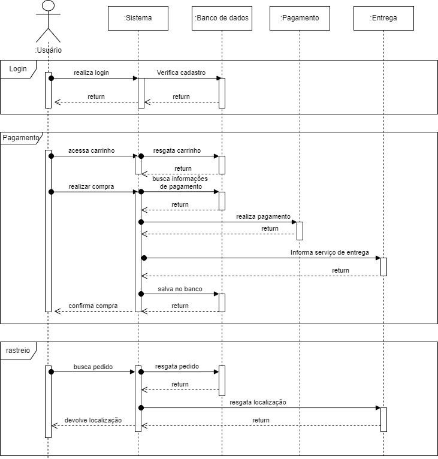

# DAS

## 1. Introdução

O **Documento de Arquitetura de Software (DAS)** é um artefato fundamental no desenvolvimento de sistemas de software complexos, oferecendo uma visão abrangente da estrutura e organização do sistema. Ele descreve os componentes principais, suas interações e os princípios de design que guiam sua construção e evolução, facilitando a comunicação entre todas as partes interessadas e garantindo uma compreensão compartilhada do sistema.

O DAS inclui várias visões arquiteturais, como a Visão Lógica, que detalha a organização conceitual do software em termos de camadas, subsistemas, pacotes, classes e interfaces, e a Visão de Implementação, que mostra a organização dos módulos, pacotes e camadas do modelo de implementação. Essas visões ajudam a reduzir a complexidade do sistema, suportam a tomada de decisões informadas e asseguram a manutenção da qualidade e a evolução contínua do software.

## 2. Objetivo

O artefato em questão tem como objetivo representar a arquitetura de software do projeto MyMarket através do modelo arquitetural **4+1** que é uma abordagem estruturada para descrever a arquitetura de software utilizando cinco vistas diferentes para capturar e abordar as diversas preocupações dos stakeholders. Este modelo foi proposto por Philippe Kruchten em 1995 e é amplamente utilizado na engenharia de software.

<h6 align = "center">Figura 01: Exemplo de modelo arquitetural 4+1. Fonte: Mateus Orlando, Pedro Lucas e Thiago Vivan.</h6>

Além disso, fizemos também a visão de Dados.

## 3. Visão de Casos de Uso

**Os alunos que participaram da documentação dessa visão foram: Pedro Lucas, GUilherme Nishimura, Miguel de Frias, Guilherme Basilio e Mateus Orlando**

Casos de uso são uma técnica de modelagem usada para descrever a funcionalidade de um sistema de forma a demonstrar como ele interage com entidades externas, conhecidas como atores. Em essência, um caso de uso descreve quem pode fazer o quê com o sistema em questão. Esta abordagem é utilizada para capturar requisitos funcionais, fornecendo uma visão clara de como o sistema deve se comportar.

Casos de uso elicitados:

| Código  | Descrição do Caso de Uso                         |
|---------|--------------------------------------------------|
| UC01    | Aplicar um cupom de desconto                     |
| UC02    | Verificar a validade de um cupom                 |
| UC03    | Gerar novos cupons de desconto                    |
| UC04    | Listar todos os cupons disponíveis                |
| UC05    | Remover um cupom de desconto                      |
| UC06    | Aplicar desconto progressivo                     |
| UC07    | Consultar histórico de uso de cupons             |
| UC08    | Configurar regras para cupons                    |
| UC09    | Notificar usuários sobre cupons expiring          |
| UC10    | Validar descontos aplicados no carrinho           |
| UC11    | Integrar cupons com campanhas promocionais       |
| UC12    | Exportar relatórios de uso de cupons             |
| UC13    | Importar cupons em massa                         |
| UC14    | Validar regras de desconto                       |
| UC15    | Aplicar cupons em promoções combinadas           |
| UC16    | Gerar relatórios de desempenho de cupons          |
| UC17    | Gerenciar limites de uso de cupons                |
| UC18    | Configurar regras de expiração de cupons          |

Tabela 2: Casos de uso elicitados

 

### Diagrama de Casos de Uso (DCU)

O diagrama de caso de uso pode ser visualizado abaixo:

## 4. Visão Lógica

**Os alunos que participaram da documentação dessa visão foram: Pedro Lucas, Thiago Vivan,Guilherme Nishimura, Pedro Henrique, Miguel de Frias, Guilherme Basilio e Mateus Orlando**

A Visão Lógica é uma parte crucial do modelo arquitetural 4+1, focada na estrutura estática do sistema de software. Esta visão descreve como os principais elementos do sistema, como classes, pacotes e módulos, são organizados e como eles interagem entre si. A Visão Lógica facilita a compreensão das funcionalidades do sistema, destacando as principais entidades e suas relações. Ela é essencial para os desenvolvedores e designers de software, fornecendo uma base sólida para a implementação e evolução do sistema. Através de diagramas de classes e pacotes, a Visão Lógica oferece uma representação clara da arquitetura interna, garantindo que a estrutura do software seja bem compreendida e que os componentes estejam adequadamente organizados para suportar as funcionalidades desejadas.

### 4.1 Diagrama de classes

O diagrama de classes é uma representação fundamental na modelagem de sistemas orientados a objetos, oferecendo uma visão detalhada da estrutura estática do sistema. Este diagrama ilustra as classes que compõem o sistema, seus atributos, métodos, e os relacionamentos entre elas, como associações, heranças e dependências. Ao fornecer uma descrição clara das entidades do sistema e suas interações, o diagrama de classes facilita a compreensão da arquitetura interna e serve como uma base sólida para o desenvolvimento e a documentação do software. Ele é amplamente utilizado para projetar e comunicar a estrutura do software entre os membros da equipe de desenvolvimento, garantindo que todos tenham uma visão compartilhada e consistente do sistema.

O diagrama de classes abaixo foi elaborado em conjunto, por todos os alunos do grupo.

Para visualizar o diagrama de classes, clique [aqui](https://lucid.app/documents/embedded/6faa106a-bd21-44dc-8ed7-5a0dd9ee38c8).

<iframe allowfullscreen frameborder="0" style="width:640px; height:480px" src="https://lucid.app/documents/embedded/6faa106a-bd21-44dc-8ed7-5a0dd9ee38c8" id="wJBSP88AHlc0"></iframe>

Este diagrama foi elaborado buscando observar e entender as classes existentes na aplicação e como elas se relacionam no escopo analisado, de avaliação de um produto. Com isso esta versão final deste diagrama possui a modelagem dos pontos identificados pelo grupo durante o projeto.

### 4.2 Diagrama de Estados

O diagrama de estados é uma ferramenta essencial na modelagem de sistemas dinâmicos, utilizada para representar os estados possíveis de um objeto ao longo do seu ciclo de vida e as transições entre esses estados. Cada estado reflete uma condição ou situação em que o objeto pode se encontrar, enquanto as transições indicam as mudanças de estado causadas por eventos ou condições específicas. Este diagrama é particularmente útil para entender e projetar o comportamento de objetos complexos que respondem a diversos estímulos. Ao proporcionar uma visualização clara das diferentes fases que um objeto pode atravessar, o diagrama de estados facilita a análise e a documentação dos aspectos dinâmicos do sistema, ajudando a garantir que o comportamento do software seja bem compreendido e corretamente implementado.

O diagrama abaixo, representado na figura 2, foi modelado pelo aluno Guilherme Nishimura.

*Fluxo de Reembolso :*

Figura 02 - Diagrama de Estados  Autores: Guilherme Nishimura

Este diagrama detalhado foi essencial para garantir que todas as etapas e possíveis estados fossem considerados e bem definidos, proporcionando uma visão abrangente e clara do fluxo de reembolsos.

### 4.3 Diagrama de Pacotes

O diagrama de pacotes é uma ferramenta crucial na modelagem de sistemas de software, utilizada para organizar e visualizar a estrutura modular do sistema. Este diagrama mostra como o sistema é dividido em pacotes, que agrupam classes e outros elementos, e as dependências entre esses pacotes. Ao representar a hierarquia e a organização dos pacotes, o diagrama de pacotes ajuda a gerenciar a complexidade do sistema, facilitando a compreensão de suas partes constituintes e suas interações. Ele é particularmente útil para planejar a arquitetura do sistema, promovendo a modularidade e a reutilização de componentes. Além disso, o diagrama de pacotes auxilia na comunicação entre os membros da equipe de desenvolvimento, garantindo que todos tenham uma visão clara e coerente da estrutura do software.

O diagrama abaixo foi elaborado pelo aluno Mateus Orlando.

Figura 03 - Diagrama de Pacotes. 

Fonte: Mateus Orlando. 

## 5. Visão de Processo 

**Os alunos que participaram da documentação dessa visão foram: Pedro Lucas, Thiago Vivan,Guilherme Nishimura, Pedro Henrique, Miguel de Frias, Guilherme Basilio e Mateus Orlando**

A visão de processo em um documento de arquitetura de software descreve os processos, atividades e fluxos de trabalho envolvidos no desenvolvimento, manutenção e evolução do software ao longo de seu ciclo de vida. Para representar a sequência lógica das atividades e o fluxo do sistema podemos utilizar do Diagrama de atividades, de sequência ou qualquer outra representação gráfica que indique como as atividades são executadas e como as informações fluem em diferentes partes do sistema.

<h6 align = "center">Figura 04: Diagrama de Sequência. Fonte: Thiago Vivan.</h6>

## 6. Visão de Implementação 

**Os alunos que participaram da documentação dessa visão foram: Pedro Lucas, Thiago Vivan,Guilherme Nishimura, Pedro Henrique, Miguel de Frias, Guilherme Basilio e Mateus Orlando**

A Visão de Implementação é um componente crítico do modelo arquitetural 4+1, focado em como o sistema de software é organizado em termos de seus componentes de código-fonte. Esta visão descreve a estrutura dos módulos, pacotes e camadas, além de ilustrar como eles são integrados para formar o sistema completo. A Visão de Implementação é essencial para desenvolvedores e gerentes de configuração, pois facilita a compreensão da arquitetura física do software e como as diferentes partes se inter-relacionam. Ao proporcionar uma visão clara da organização do código e das dependências entre os componentes, esta visão ajuda a garantir que o sistema seja modular, escalável e fácil de manter, suportando assim uma implementação eficaz e eficiente do software. 
 
Para esse visão, usamos o diagrama de componentes, apresentado a seguir, feito pelo aluno Guilherme Oliveira.

Figura 05 - Diagrama de Componentes  Autor: Guilherme de Oliveira

## 7. Visão de Implantação

**Os alunos que participaram da documentação dessa visão foram: Pedro Lucas, Thiago Vivan,Guilherme Nishimura, Pedro Henrique, Miguel de Frias, Guilherme Basilio e Mateus Orlando**

Os diagramas de implantação são uma ferramenta essencial para arquitetos de software e engenheiros de sistemas, permitindo a visualização e o planejamento da distribuição física dos componentes de software. Eles garantem que todos os aspectos físicos da implantação do sistema sejam compreendidos e documentados, facilitando a comunicação entre as partes interessadas e assegurando uma implementação bem-sucedida do sistema.

Este documento apresenta a arquitetura de implantação de um sistema distribuído, com foco em eficiência, segurança e escalabilidade. O sistema é estruturado em vários nós principais: Cliente, Proxy, Web Server e Database, cada um contendo componentes e entidades específicas. É importante destacar que o diagrama foi elaborado sem a definição completa das tecnologias a serem utilizadas, podendo sofrer alterações conforme as decisões do grupo evoluem.

Figura 06 - Diagrama de Implantação  Autor: Mateus Orlando

### 7.1 Nó PC/Mobile
- Componentes:
  - Browser: Interface de usuário para acesso ao sistema.
- Comunicação:
  - Estabelece uma conexão TCP/IP com o nó Proxy.

### 7.2 Nó Proxy
- Componentes:
  - Gerenciamento de Cache:
    - Entidade Cache: Responsável por armazenar dados frequentemente acessados, melhorando a resposta do sistema.
  - Segurança:
    - Entidade Filtro de Navegação: Filtra requisições para segurança do sistema.
- Comunicação:
  - Conecta-se ao Web Server via HTTPS.

### 7.3 Nó Web Server
- Componentes:
  - Permissão de Usuário: Gerencia as permissões e acessos dos usuários.
  - Federação de Usuário: Facilita a autenticação de usuários de diferentes domínios.
- Comunicação:
  - Estabelece uma conexão TCP/IP com o nó DBServer.

### 7.4 Nó Database
- Componentes:
  - MySQL: Responsável pelo armazenamento e gerenciamento de dados.

### 7.5 Fluxo de Dados e Controle
1. Do Cliente ao Proxy: O tráfego inicia no PC ou dispositivo mobile, passa pelo Browser e é direcionado ao Proxy via TCP/IP.
2. Do Proxy ao Web Server: O Proxy processa as requisições, aplicando cache, segurança, antes de enviar ao Web Server via HTTPS.
3. Do Web Server ao Database: Após processamento no Web Server, as requisições são encaminhadas para o Database para operações de dados.

# 8 Visão de Dados
 
**Os alunos que participaram da documentação dessa visão foram: Guilherme Oliveira Mendes, João victor Costa(P.O) e Rodrigo Wright**

A visão de dados é um componente essencial na arquitetura de sistemas, responsável por descrever a estrutura, organização e fluxo dos dados dentro de uma aplicação. Ela fornece uma compreensão detalhada de como os dados são armazenados, acessados e manipulados, servindo como um guia para garantir a integridade, consistência e segurança das informações no sistema.
 

No projeto em questão, foram desenvolvidos um Modelo Entidade-Relacionamento (ME-R), que foi validado pelo Product Owner do projeto, depois disso foi feito um Diagrama Entidade-Relacionamento (DE-R) e um Diagrama Lógico de Dados (DLD). O ME-R e o DE-R representam graficamente as entidades do sistema e suas relações, enquanto o DLD detalha a estrutura lógica dos dados, mostrando como eles serão organizados e manipulados no banco de dados. Esses artefatos são fundamentais para garantir que a modelagem dos dados esteja alinhada com os requisitos do sistema, facilitando a implementação e manutenção.

## 8.1 ME-R
No projeto em questão, foi desenvolvido um Modelo Entidade-Relacionamento (ME-R) como parte da visão de dados. O ME-R foi criado com o objetivo de representar as principais entidades e seus relacionamentos no sistema, servindo como uma base fundamental para a estruturação do banco de dados.

Após a elaboração do ME-R, foi realizada uma validação por meio de uma entrevista online com o Product Owner (João Costa) do projeto. A entrevista ocorreu via Microsoft Teams e teve como propósito garantir que o modelo atendesse aos requisitos e expectativas do cliente, bem como identificar possíveis ajustes ou melhorias. Essa validação foi essencial para assegurar o alinhamento entre o modelo de dados proposto e as necessidades do projeto, contribuindo para a qualidade e a eficácia da solução desenvolvida.

Gravação da Reunião de validação do ME-R : https://www.youtube.com/watch?v=p-feHWuKib0

 

### Entidades:
- CLIENTE
- ENDERECO
- TELEFONE
- PRODUTO
- AVALIACAO
- VENDA
- FORNECEDOR
- PRODUTOCOR 
- PRODUTOTAMANHO
- PRODUTOCATEGORIA
   
 

### Atributos:
- CLIENTE (senha, nome, cpf, rg, dataNascimento, email) 
- ENDERECO(cep, rua, numero, complemento)
- TELEFONE(ddi, ddd, numero)
- PRODUTO (idProduto, nome, categoria, descricao, valorAquisicao, valorVenda, imagem,quantidade, cnpjFornecedor )
- AVALIACAO (cpfCliente, idProduto, comentario, dataPostagem, nota)
- VENDA (idVenda, cpfCliente, valor, descricao)
- FORNECEDOR(nome, cnpj, email, numero)
- PRODUTOCOR ((hexadecimal), cor,)
- PRODUTOTAMANHO ((centimetros), tamanho)
- PRODUTOCATEGORIA ((descricao), categoria)

 

### Relacionamentos:
- CLIENTE - participa - VENDA

cardinalidade 1:m
- VENDA - contém - PRODUTO

cardinalidade n:m
- CLIENTE - possui - ENDERECO

cardinalidade n:m
- CLIENTE - detém - TELEFONE
 cardinalidade 1:n
- CLIENTE - faz - AVALIACAO
 
 cardinalidade 1:n
- FORNECEDOR - tem - TELEFONE
 
 cardinalidade 1:n
- PRODUTO - fornecido - FORNECEDOR

cardinalidade n:m
- PRODUTO - tem - PRODUTOCOR

cardinalidade n:m
- PRODUTO - disponivel - PRODUTOTAMANHO

cardinalidade n:m
- PRODUTO - pertence - PRODUTOCATEGORIA

cardinalidade n:m

## 8.2 DE-R

O DE-R, desenvolvido no BRModelo com base no ME-R depois de validado pelo P.O, capturou as principais entidades e seus relacionamentos, servindo como base para a modelagem do banco de dados.

 

<h6 align = "center">Figura 1: Diagrama Entidade-Relacionamento</h6>

## 8.3 DLD

 A partir do diagrama entidade-relacionamento, foi possível gerar o DLD, que detalha a implementação lógica das entidades e suas interações no banco de dados relacional. 

<h6 align = "center">Figura 2: Diagrama Lógico de Dados </h6>
Referências

### Conclusão

Este sistema apresenta uma arquitetura robusta e segura, com ênfase na eficiência de processamento, segurança da informação e privacidade do usuário. Cada nó e componente foi estrategicamente posicionado para otimizar a performance, garantir a segurança e permitir a escalabilidade do sistema. Através do detalhamento fornecido pelo diagrama de implantação, conseguimos visualizar claramente a distribuição física dos componentes e as suas interações, assegurando que a infraestrutura do "My Market" seja bem planejada e configurada para atender aos requisitos do projeto de forma eficaz. Esta abordagem não só facilita a comunicação entre as partes interessadas, mas também contribui para uma implementação bem-sucedida e sustentável do sistema.

## Referências

> **Arquitetura e Desenho de Software - Aula DAS**. Material de apoio em slides. Milene Serrano.

> FAKHROUTDINOV, Kirill. UML. UML 2.5 Diagrams Overview. [S. l.], 2023. Disponível em: https://www.uml-diagrams.org/uml-25-diagrams.html. Acesso em: 02 ago. 2024.

## Versionamento

| Versão | Alteração |  Responsável  | Revisor | Data de realização |
| :------: | :---: | :-----: | :----: | :----: |
| 1.0    | Criação do Documento Geral de DAS | [Mateus Orlando](https://github.com/MateusPy) | - | 15/08/2024 |
