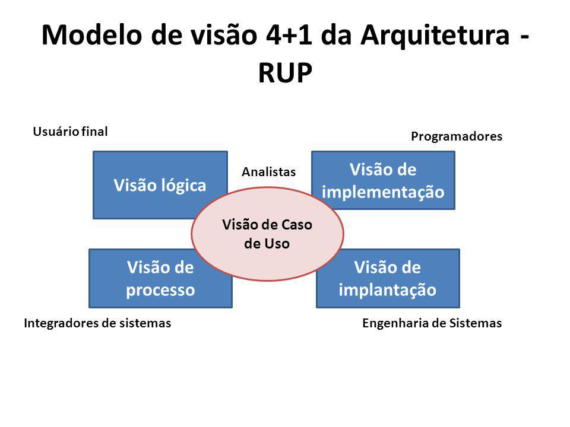

# DAS

## 1. Introdução

O **Documento de Arquitetura de Software (DAS)** é um artefato fundamental no desenvolvimento de sistemas de software complexos, oferecendo uma visão abrangente da estrutura e organização do sistema. Ele descreve os componentes principais, suas interações e os princípios de design que guiam sua construção e evolução, facilitando a comunicação entre todas as partes interessadas e garantindo uma compreensão compartilhada do sistema.

O DAS inclui várias visões arquiteturais, como a Visão Lógica, que detalha a organização conceitual do software em termos de camadas, subsistemas, pacotes, classes e interfaces, e a Visão de Implementação, que mostra a organização dos módulos, pacotes e camadas do modelo de implementação. Essas visões ajudam a reduzir a complexidade do sistema, suportam a tomada de decisões informadas e asseguram a manutenção da qualidade e a evolução contínua do software.

## 2. Objetivo

O artefato em questão tem como objetivo representar a arquitetura de software do projeto MyMarket através do modelo arquitetural **4+1** que é uma abordagem estruturada para descrever a arquitetura de software utilizando cinco vistas diferentes para capturar e abordar as diversas preocupações dos stakeholders. Este modelo foi proposto por Philippe Kruchten em 1995 e é amplamente utilizado na engenharia de software.

<h6 align = "center">Figura 01: Exemplo de modelo arquitetural 4+1. Fonte: Mateus Orlando, Pedro Lucas e Thiago Vivan.</h6>

## 3. Visão de Casos de Uso

Casos de uso são uma técnica de modelagem usada para descrever a funcionalidade de um sistema de forma a demonstrar como ele interage com entidades externas, conhecidas como atores. Em essência, um caso de uso descreve quem pode fazer o quê com o sistema em questão. Esta abordagem é utilizada para capturar requisitos funcionais, fornecendo uma visão clara de como o sistema deve se comportar.

Casos de uso elicitados:

| Código  | Descrição do Caso de Uso       |
|---------|--------------------------------|
| UC01    |                 |
| UC02    |                 |
| UC03    |                 |
| UC04    |                 |
| UC05    |                 |
| UC06    |                 |
| UC07    |                 |
| UC08    |                 |
| UC09    |                 |
| UC10    |                 |
| UC11    |                 |
| UC12    |                 |
| UC13    |                 |
| UC14    |                 |
| UC15    |                 |
| UC16    |                 |
| UC17    |                 |
| UC18    |                 |

Tabela 2: Casos de uso elicitados

 

###  diagrama de casos de uso (DCU)

## 4. Visão Lógica

A Visão Lógica é uma parte crucial do modelo arquitetural 4+1, focada na estrutura estática do sistema de software. Esta visão descreve como os principais elementos do sistema, como classes, pacotes e módulos, são organizados e como eles interagem entre si. A Visão Lógica facilita a compreensão das funcionalidades do sistema, destacando as principais entidades e suas relações. Ela é essencial para os desenvolvedores e designers de software, fornecendo uma base sólida para a implementação e evolução do sistema. Através de diagramas de classes e pacotes, a Visão Lógica oferece uma representação clara da arquitetura interna, garantindo que a estrutura do software seja bem compreendida e que os componentes estejam adequadamente organizados para suportar as funcionalidades desejadas.

### 4.1 Diagrama de classes

O diagrama de classes é uma representação fundamental na modelagem de sistemas orientados a objetos, oferecendo uma visão detalhada da estrutura estática do sistema. Este diagrama ilustra as classes que compõem o sistema, seus atributos, métodos, e os relacionamentos entre elas, como associações, heranças e dependências. Ao fornecer uma descrição clara das entidades do sistema e suas interações, o diagrama de classes facilita a compreensão da arquitetura interna e serve como uma base sólida para o desenvolvimento e a documentação do software. Ele é amplamente utilizado para projetar e comunicar a estrutura do software entre os membros da equipe de desenvolvimento, garantindo que todos tenham uma visão compartilhada e consistente do sistema.

O diagrama de classes abaixo foi elaborado em conjunto, por todos os alunos do grupo.

Para visualizar o diagrama de classes, clique [aqui](https://lucid.app/documents/embedded/6faa106a-bd21-44dc-8ed7-5a0dd9ee38c8).

<iframe allowfullscreen frameborder="0" style="width:640px; height:480px" src="https://lucid.app/documents/embedded/6faa106a-bd21-44dc-8ed7-5a0dd9ee38c8" id="wJBSP88AHlc0"></iframe>

Este diagrama foi elaborado buscando observar e entender as classes existentes na aplicação e como elas se relacionam no escopo analisado, de avaliação de um produto. Com isso esta versão final deste diagrama possui a modelagem dos pontos identificados pelo grupo durante o projeto.

### 4.2 Diagrama de Estados

O diagrama de estados é uma ferramenta essencial na modelagem de sistemas dinâmicos, utilizada para representar os estados possíveis de um objeto ao longo do seu ciclo de vida e as transições entre esses estados. Cada estado reflete uma condição ou situação em que o objeto pode se encontrar, enquanto as transições indicam as mudanças de estado causadas por eventos ou condições específicas. Este diagrama é particularmente útil para entender e projetar o comportamento de objetos complexos que respondem a diversos estímulos. Ao proporcionar uma visualização clara das diferentes fases que um objeto pode atravessar, o diagrama de estados facilita a análise e a documentação dos aspectos dinâmicos do sistema, ajudando a garantir que o comportamento do software seja bem compreendido e corretamente implementado.

O diagrama abaixo, representado na figura 2, foi modelado pelo aluno Guilherme Nishimura.

*Fluxo de Reembolso :*

Figura 2 - Diagrama de Estados  Autores: Guilherme Nishimura

Este diagrama detalhado foi essencial para garantir que todas as etapas e possíveis estados fossem considerados e bem definidos, proporcionando uma visão abrangente e clara do fluxo de reembolsos.

### 4.3 Diagrama de Pacotes

O diagrama de pacotes é uma ferramenta crucial na modelagem de sistemas de software, utilizada para organizar e visualizar a estrutura modular do sistema. Este diagrama mostra como o sistema é dividido em pacotes, que agrupam classes e outros elementos, e as dependências entre esses pacotes. Ao representar a hierarquia e a organização dos pacotes, o diagrama de pacotes ajuda a gerenciar a complexidade do sistema, facilitando a compreensão de suas partes constituintes e suas interações. Ele é particularmente útil para planejar a arquitetura do sistema, promovendo a modularidade e a reutilização de componentes. Além disso, o diagrama de pacotes auxilia na comunicação entre os membros da equipe de desenvolvimento, garantindo que todos tenham uma visão clara e coerente da estrutura do software.

O diagrama abaixo foi elaborado pelo aluno Mateus Orlando.

Figura 3 - Diagrama de Pacotes. 

Fonte: Mateus Orlando. 

## 5. Visão de Processo 

Para o projeto, foi desenvolvidos um diagrama de processo que explicíta tais processos em forma de _threads_ que executam atividades essênciais do sistema. As interações são feitas por meio de funções representativas que guiam o fluxo de processo com base no que é possível ser realizado.

*Figura 6: Diagrama de Processo*

Abaixo estão descritas as funções referentes aos principais processos:

### Usuário

| Nome | Descrição | Destino |
|------|-----------|---------|
| u1: postarComentario() | Posta um comentário | GestãoComentário |
| u2: editarComentario() | Edita um comentário | GestãoComentário |
| u3: deletarComentario() | Deleta um comentário | GestãoComentário |
| u4: avaliarAvaliacao() |  Avalia uma avaliação já existente | GestãoComentário |
| u5: postarAvaliacao() | Posta uma avaliação de um produto | GestãoComentário |
| u6: verAvaliacoes() | Visualiza as avaliações existentes | GestãoComentário |
| u7: atualizarAvaliacao() | Atualiza uma avaliação | GestãoComentário |
| u8: deletarAvaliacao() | Deleta uma avaliação | GestãoComentário |
| u9: buscarProduto() | Busca os produtos aptos a serem trocados | ProgramaRecompensa |
| u10: resgatarProduto() | Resgata um produto em troca de pontos | ProgramaRecompensa |
| u11: verificarPontos() | Verifica os pontos já obtidos | ProgramaRecompensa |

*Tabela 3: Descrição do processo Usuário*

### Moderador

| Nome | Descrição | Destino |
|------|-----------|---------|
| m1: validaAvaliacao() | Retorna se um comentário foi validado ou não | GestãoComentário |

*Tabela 4: Descrição do processo Moderador*

### ProgramaRecompensa

| Nome | Descrição | Destino |
|------|-----------|---------|
| pr1: mostrarProdutos() | Retorna os produtos disponíveis para troca | Usuário |
| pr2: resgatarProduto() | Valida e realiza a troca se foi bem sucedida | Usuário |
| pr3: mostrarPontos() | Retorna a quantidade de pontos do usuário| Usuário |
| pr4: buscarProduto() | Busca os produtos disponíveis no banco de dados de produtos | BancoDadosProdutos |
| pr5: atualizarProduto() | Atualiza o estado dos produtos (disponível/indisponível) | BancoDadosProdutos |

*Tabela 5: Descrição do processo ProgramaRecompensa*

### GestãoComentário

| Nome | Descrição | Destino |
|------|-----------|---------|
| c1: requisitaValidacao() | Requisita a validação de um comentráio | Moderador |
| c2: mostraAvaliacoes() | Retorna as avaliações existentes | Usuário |
| c3: pontuarUsuario() | Pontua o usuário com base nas avaliações e reações a comentários feita | ProgramaRecompensa |
| c4: buscarAvaliacao() | Busca as avaliações existentes no banco de dados | BancoDadosAvaliacao |
| c5: inserirAvaliacao() | Inseri uma nova avaliação no banco de dados | BancoDadosAvaliacao |
| c6: excluirAvaliacao() | Exclui uma avaliação do banco de dados | BancoDadosAvaliacao |
| c7: atualizarAvaliacao() | Atualiza uma avaliação do banco de dados| BancoDadosAvaliacao |

*Tabela 6: Descrição do processo GestãoComentário*

## 6. Visão de Implementação 

A Visão de Implementação é um componente crítico do modelo arquitetural 4+1, focado em como o sistema de software é organizado em termos de seus componentes de código-fonte. Esta visão descreve a estrutura dos módulos, pacotes e camadas, além de ilustrar como eles são integrados para formar o sistema completo. A Visão de Implementação é essencial para desenvolvedores e gerentes de configuração, pois facilita a compreensão da arquitetura física do software e como as diferentes partes se inter-relacionam. Ao proporcionar uma visão clara da organização do código e das dependências entre os componentes, esta visão ajuda a garantir que o sistema seja modular, escalável e fácil de manter, suportando assim uma implementação eficaz e eficiente do software. 
 
Para esse visão, usamos o diagrama de componentes, apresentado a seguir, feito pelo aluno Guilherme Oliveira.

Figura 5 - Diagrama de Componentes  Autor: Guilherme de Oliveira

## 7. Visão de Implantação

Os diagramas de implantação são uma ferramenta essencial para arquitetos de software e engenheiros de sistemas, permitindo a visualização e o planejamento da distribuição física dos componentes de software. Eles garantem que todos os aspectos físicos da implantação do sistema sejam compreendidos e documentados, facilitando a comunicação entre as partes interessadas e assegurando uma implementação bem-sucedida do sistema.

Este documento apresenta a arquitetura de implantação de um sistema distribuído, com foco em eficiência, segurança e escalabilidade. O sistema é estruturado em vários nós principais: Cliente, Proxy, Web Server e Database, cada um contendo componentes e entidades específicas. É importante destacar que o diagrama foi elaborado sem a definição completa das tecnologias a serem utilizadas, podendo sofrer alterações conforme as decisões do grupo evoluem.

Figura 6 - Diagrama de Implantação  Autor: Mateus Orlando

### 7.1 Nó PC/Mobile
- Componentes:
  - Browser: Interface de usuário para acesso ao sistema.
- Comunicação:
  - Estabelece uma conexão TCP/IP com o nó Proxy.

### 7.2 Nó Proxy
- Componentes:
  - Gerenciamento de Cache:
    - Entidade Cache: Responsável por armazenar dados frequentemente acessados, melhorando a resposta do sistema.
  - Segurança:
    - Entidade Filtro de Navegação: Filtra requisições para segurança do sistema.
- Comunicação:
  - Conecta-se ao Web Server via HTTPS.

### 7.3 Nó Web Server
- Componentes:
  - Permissão de Usuário: Gerencia as permissões e acessos dos usuários.
  - Federação de Usuário: Facilita a autenticação de usuários de diferentes domínios.
- Comunicação:
  - Estabelece uma conexão TCP/IP com o nó DBServer.

### 7.4 Nó Database
- Componentes:
  - MySQL: Responsável pelo armazenamento e gerenciamento de dados.

### 7.5 Fluxo de Dados e Controle
1. Do Cliente ao Proxy: O tráfego inicia no PC ou dispositivo mobile, passa pelo Browser e é direcionado ao Proxy via TCP/IP.
2. Do Proxy ao Web Server: O Proxy processa as requisições, aplicando cache, segurança, antes de enviar ao Web Server via HTTPS.
3. Do Web Server ao Database: Após processamento no Web Server, as requisições são encaminhadas para o Database para operações de dados.

### Conclusão

Este sistema apresenta uma arquitetura robusta e segura, com ênfase na eficiência de processamento, segurança da informação e privacidade do usuário. Cada nó e componente foi estrategicamente posicionado para otimizar a performance, garantir a segurança e permitir a escalabilidade do sistema. Através do detalhamento fornecido pelo diagrama de implantação, conseguimos visualizar claramente a distribuição física dos componentes e as suas interações, assegurando que a infraestrutura do "My Market" seja bem planejada e configurada para atender aos requisitos do projeto de forma eficaz. Esta abordagem não só facilita a comunicação entre as partes interessadas, mas também contribui para uma implementação bem-sucedida e sustentável do sistema.

## Referências

> **Arquitetura e Desenho de Software - Aula DAS**. Material de apoio em slides. Milene Serrano.

> FAKHROUTDINOV, Kirill. UML. UML 2.5 Diagrams Overview. [S. l.], 2023. Disponível em: https://www.uml-diagrams.org/uml-25-diagrams.html. Acesso em: 02 ago. 2024.

## Versionamento

| Versão | Alteração |  Responsável  | Revisor | Data de realização |
| :------: | :---: | :-----: | :----: | :----: |
| 1.0    | Inicio da estrutura do documento. | [Mateus Orlando](https://github.com/MateusPy), [Pedro Lucas](https://github.com/AlefMemTav) e [Thiago Vivan](https://github.com/thiago-vivan) | [Thiago Vivan](https://github.com/thiago-vivan) | 02/08/2024 |
| 2.0    | Alteração da descrção do diagrama de implantação | [Mateus Orlando](https://github.com/MateusPy), [Pedro Lucas](https://github.com/AlefMemTav) e [Thiago Vivan](https://github.com/thiago-vivan) | [Thiago Vivan](https://github.com/thiago-vivan) | 03/08/2024 |
| 3.0    | Modelagem do diagrama de implantação | [Mateus Orlando](https://github.com/MateusPy), [Pedro Lucas](https://github.com/AlefMemTav) e [Thiago Vivan](https://github.com/thiago-vivan) | [Thiago Vivan](https://github.com/thiago-vivan) | 03/08/2024 |
| 3.1    | Adição do diagrama de implantação na documentação | [Mateus Orlando](https://github.com/MateusPy), [Pedro Lucas](https://github.com/AlefMemTav) e [Thiago Vivan](https://github.com/thiago-vivan) | [Thiago Vivan](https://github.com/thiago-vivan) | 05/08/2024 |
| 4.0   | Adição dos seguintes diagramas a Visão Lógica: Classes, Estados e Pacotes | [Mateus Orlando](https://github.com/MateusPy), [Pedro Lucas](https://github.com/AlefMemTav) e [Thiago Vivan](https://github.com/thiago-vivan) | [Thiago Vivan](https://github.com/thiago-vivan) | 05/08/2024 |
| 5.0   | Adição da Visão de Implementação | [Mateus Orlando](https://github.com/MateusPy), [Pedro Lucas](https://github.com/AlefMemTav) e [Thiago Vivan](https://github.com/thiago-vivan) | [Thiago Vivan](https://github.com/thiago-vivan) | 05/08/2024 |

