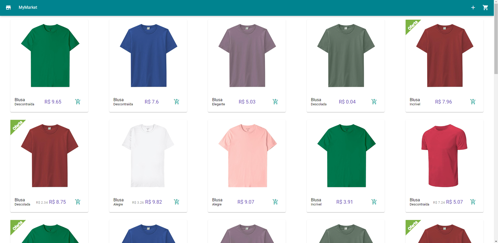
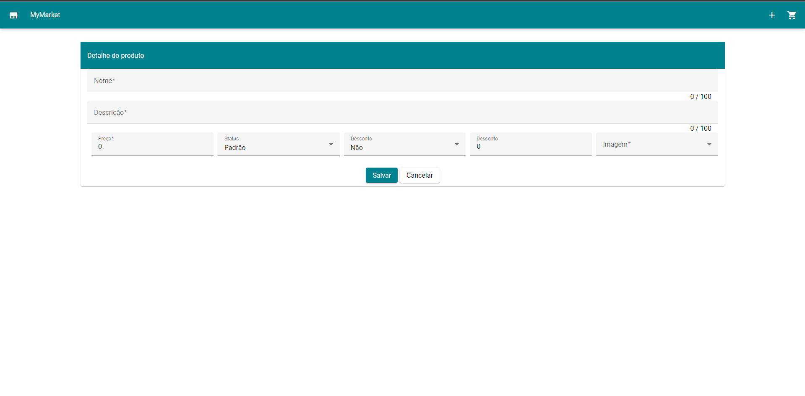
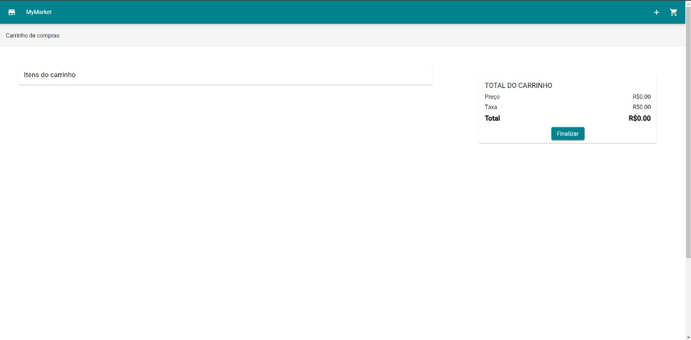

# Documentação do MVP

## Descrição do MVP
### 1 - Home Page

**Objetivo da Tela:**

Apresentar ao usuário uma lista de produtos disponíveis para compra, no caso específico, blusas de diversas cores. A tela visa facilitar a navegação do usuário e a comparação entre os diferentes produtos.

**Elementos da Interface:**

* **Cabeçalho:**
    * Título da página: "MyMarket"
    * Botão "+" (sugere a possibilidade de adicionar novos produtos ou realizar outras ações).
* **Corpo da Página:**
    * **Grid de Produtos:** A área principal da tela é organizada em um grid (grade) que exibe os produtos de forma visualmente atrativa e organizada.
    * **Cada Produto:**
        * **Imagem:** Uma imagem representativa do produto, demonstrando sua cor e estilo.
        * **Nome:** A palavra "Blusa" indica o tipo de produto.
        * **Preço:** O preço do produto em reais (R$).
        * **Descrição:** Uma breve descrição do produto (e.g., "Descontraída", "Elegante").
        * **Botão "Adicionar ao Carrinho":** Um ícone de carrinho de compras ou um botão com essa descrição, permitindo que o usuário adicione o produto ao carrinho de compras.

**Funcionalidades:**

* **Navegação:** O usuário pode navegar pela lista de produtos utilizando os elementos visuais da página (grid, rolagem).
* **Seleção de Produtos:** Ao clicar no botão "Adicionar ao Carrinho", o produto selecionado é adicionado ao carrinho de compras do usuário.
* **Comparação de Produtos:** A disposição dos produtos em um grid facilita a comparação visual entre as diferentes opções de cores e preços.

**Considerações Adicionais:**

* **Responsividade:** A tela deve ser responsiva, adaptando-se a diferentes tamanhos de tela (desktop, tablet, mobile).
* **Acessibilidade:** É importante garantir que a tela seja acessível a todos os usuários, seguindo as diretrizes de acessibilidade web.
* **Performance:** A tela deve carregar rapidamente e garantir uma experiência fluida para o usuário.

**Próximos Passos:**

* **Detalhamento de cada produto:** Ao clicar em um produto específico, o usuário deve ser direcionado para uma página com mais detalhes sobre o produto (descrição completa, tamanhos disponíveis, etc.).
* **Filtros e busca:** Adicionar filtros para auxiliar o usuário a encontrar produtos específicos (e.g., por cor, preço, tamanho).

**Recomendações:**

* **Testes de usabilidade:** Realizar testes de usabilidade com usuários reais para identificar possíveis problemas de navegação e interação.
* **Análise de dados:** Coletar dados sobre o comportamento dos usuários para otimizar a experiência de compra.

### 2 - Tela de Cadastro de Produto

**Objetivo da Tela:**

Permitir que um usuário cadastrado adicione um novo produto ao catálogo da loja virtual "MyMarket".

**Elementos da Interface:**
* **Cabeçalho:**
    * Título da página: "MyMarket"
    * Ícone de carrinho de compras
* **Corpo da Página:**
    * **Título da Seção:** "Detalhe do produto"
    * **Campos de Cadastro:**
        * Nome: [campo de texto]
        * Descrição: [área de texto]
        * Preço: [campo numérico]
        * Status: [dropdown]
        * Desconto: [campo numérico]
        * Tamanho: [dropdown]
        * Imagem: [campo de upload ou campo para URL]
    * **Botões de Ação:**
        * Salvar
        * Cancelar

### Funcionalidades
* Cadastro de Produtos
* Gerenciamento de Status
* Gerenciamento de Descontos
* Gerenciamento de Imagens
* Validação de Dados

### Considerações Adicionais
* Campos Personalizáveis
* Gerenciamento de Variantes
* Integração com o Catálogo de Produtos

### Próximos Passos
* Documentação Detalhada
* Testes
* Usabilidade
* Segurança

### 3 - Página do Carrinho de Compras

**Objetivo da Tela:**

Exibir os itens que o usuário adicionou ao carrinho de compras, permitindo que ele revise a lista de produtos antes de finalizar a compra. A tela também apresenta o total do pedido, incluindo o preço dos itens e possíveis taxas, além de oferecer a opção de finalizar a compra.

**Elementos da Interface:**

* **Cabeçalho:**
    * Título da página: "MyMarket"
    * Botão "+" (sugere a possibilidade de adicionar novos produtos ou realizar outras ações).
    * Ícone de "Carrinho de Compras" no canto superior direito, indicando a possibilidade de revisar ou alterar o carrinho de compras.

* **Corpo da Página:**
    * **Itens do Carrinho:**
        * **Lista de Produtos:** Um campo que deve listar todos os produtos que o usuário adicionou ao carrinho. No momento, este campo parece estar vazio, o que pode indicar um carrinho vazio ou uma área de preparação para exibir os itens.
    * **Total do Carrinho:**
        * **Resumo dos Custos:** Um resumo à direita da tela que detalha o preço total dos produtos e possíveis taxas adicionais.
        * **Botão "Finalizar":** Um botão de ação que permite ao usuário concluir a compra, direcionando-o para a página de pagamento ou confirmação do pedido.

**Funcionalidades:**

* **Revisão de Produtos:** O usuário pode visualizar todos os produtos adicionados ao carrinho antes de prosseguir para o checkout.
* **Finalização da Compra:** Ao clicar no botão "Finalizar", o usuário é levado ao próximo passo no processo de compra, que pode incluir informações de pagamento e envio.

**Considerações Adicionais:**

* **Responsividade:** A tela deve ser responsiva, adaptando-se a diferentes tamanhos de tela (desktop, tablet, mobile).
* **Acessibilidade:** Garantir que a tela seja acessível a todos os usuários, seguindo as diretrizes de acessibilidade web.
* **Usabilidade:** O design simples e direto ajuda a evitar confusões, assegurando que o usuário entenda facilmente o próximo passo na jornada de compra.

**Próximos Passos:**

* **Adição de mais funcionalidades:** Considerar a inclusão de opções para editar as quantidades dos produtos ou remover itens diretamente no carrinho.
* **Detalhamento dos produtos:** Ao clicar em um item listado, o usuário deve ser capaz de ver mais detalhes sobre o produto, caso deseje revisar antes de finalizar a compra.

**Recomendações:**

* **Testes de usabilidade:** Realizar testes com usuários para garantir que o processo de revisão do carrinho e finalização da compra é intuitivo.
* **Análise de comportamento:** Coletar dados sobre o uso do carrinho de compras para identificar possíveis melhorias no processo de checkout.

## Versionamento

| Versão | Alteração |  Responsável  | Revisor | Data de realização |
| :------: | :---: | :-----: | :----: | :----: |
| 1.0    | Criação do documento | [Artur Rodrigues](https://github.com/ArturRSA19) & [Guilherme Soares](https://github.com/GuilhermeSoaress) | -  | 16/08/2024 |
| 1.1    | Documentação da HomePage | [Artur Rodrigues](https://github.com/ArturRSA19) | [Guilherme Soares](https://github.com/GuilhermeSoaress) | 16/08/2024 |
| 1.2    | Documentação da CreateProductPage | [Guilherme Soares](https://github.com/GuilhermeSoaress)  | [Artur Rodrigues](https://github.com/ArturRSA19) | 16/08/2024 |
| 1.3    | Documentação da Tela de finalizar compra | [Guilherme Soares](https://github.com/GuilhermeSoaress)  | [Artur Rodrigues](https://github.com/ArturRSA19) | 16/08/2024 |