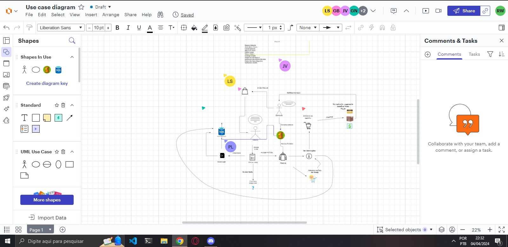

# 1.1. Módulo Projeto Não Orientado a Abordagens Específicas

## Definição

Segundo o material disponibilizado pela professora, Design Sprint é uma metodologia colaborativa e ágil para conceituar e concretizar as implementações e funcionalidades de uma ideia ou produto em um curto espaço de tempo, possuindo quatro etapas: Unpack, Sketch, Decision e Prototype.

## Design Sprint

### Unpack

Nesta etapa, o objetivo é gerar vários insights (compreensões sobre o problema), produzidos com a participação de todos. Devem ser debatidos vários aspectos da solução computacional desejada, no intuito de se ter um levantamento razoável do escopo da solução.

Para realizar essa atividade, o grupo optou por empregar a técnica de elicitação Análise de Concorrente para discernir os elementos cruciais para um site de supermercados, realizando uma análise em plataformas como Extra, Americanas, Kabum e Amazon. 

Posteriormente, uma deliberação entre os membros por um grupo no WhatsAp resultou na sugestão de integrar um chatbot ao produto, além de direcionar o site para uma vertente específica, no caso a área de venda de roupas, acessórios e calçados.

Após isso foi feita uma reunião no Discord e foi decidido pela elaboração de um mapa mental, delineando as funcionalidades consideradas essenciais para o site.

### Sketch

Na fase de Sketch, deliberou-se que todos os integrantes elaborariam Rich Pictures. Foi decidido que metade da equipe criaria representações mais abrangentes da loja, enquanto a outra metade se concentraria em aspectos mais específicos do site. Após essa decisão, todos os membros concordaram em prosseguir para a etapa de Decision durante a reunião realizada no Discord.

### Decision

Na fase de decisão (Decision), os membros da equipe devem se reunir para abstrair as ideias da etapa anterior (Sketch) e decidir as principais funcionalidades e operações do sistema. Sendo assim, a equipe fez uso dos Rich Pictures produzidos anteriormente pelos membros da equipe e juntou as ideias em um só. O resultado foi um artefato de fácil compreensão, que descreve os principais processos que o sistema deve abordar.

Para o desenvolvimento desse “Rich Picture”, a equipe se reuniu em chamada via Discord e conversou sobre os artefatos produzidos. Depois da discussão, foi escolhido o artefato do Lucas Spinosa, porque ele fez uso de uma ferramenta que permitia o acesso de múltiplos membros (LucidChart), além de possuir vários dos pontos observados em outros artefatos. 

Sendo assim, os membros presentes na reunião fizeram algumas alterações como a inclusão de um banco de dados, o papel da loja física no processo e o enxutamento de algumas funcionalidades que estavam muito específicas.

Equipe desenvolvendo o Rich Picture em conjunto (Alguns estão no discord pois estavam compartilhando a tela):

### Protótipos

#### Tela Home

#### Tela Login

#### Tela Cadastro

#### Tela Pagamento

#### Tela Perfil

## Técnicas de Elicitação

### Análise de Concorrentes

Análise de Concorrentes consiste em analisar os produtos dos concorrentes a fim de identificar características em comum, como atendem às necessidades dos clientes e quais são suas particularidades, para que assim se possa obter informações valiosas para o desenvolvimento de uma solução própria.

Essa técnica foi aplicada pela equipe analisando, primariamente, o site Extra, conforme recomendação da professora, além dos sites Americanas, Kabum e Amazon. Os resultados ajudaram a gerar mais entendimento a respeito do negócio e identificar funcionalidades relevantes:

- Buscar um produto por nome, categoria e marca;

- Ordenar os resultados da busca por preço, avaliações e mais vendidos;

- Entrar em contato com a loja por redes sociais, chat online, e-mail e telefone;

- Ver informações sobre a plataforma, como dúvidas frequentes e termos de uso;

- Escolher dentre várias formas de pagamento de um produto no momento da compra;

### Entrevista

Entrevista, como o próprio nome diz, é uma entrevista que a equipe de desenvolvimento realiza com os stakeholders (interessados no produto, como usuários, investidores, entre outros), sendo importante considerar todas as perspectivas dos envolvidos.

A modalidade escolhida foi fazer uma entrevista fechada, isto é, o entrevistado responder a um conjunto definido de questões, conforme mostrado na Tabela 2, com o Product Owner (P.O) [João Costa](https://github.com/jvcostta). 

Foram utilizadas perguntas abertas, permitindo que o entrevistado respondesse de forma livre, demonstrando suas opiniões, experiências e sugestões, e consequentemente contribuindo para uma maior compreensão do domínio do projeto. As respostas da entrevista e a execução da mesma pode ser visualizado na Tabela 2 e Vídeo 1, respectivamente.

**Tabela 1** -  Participantes
 
| Entrevistadores | Data | Horário | Entrevistado | Local |
| -------- | -------- | -------- | -------- | ----- |
|  Mateus Orlando e Rodrigo Wright   | 07/04/2024 | 22:00 | João Costa | Microsoft Teams |

Fonte: João Costa, Mateus Orlando, Rodrigo Wright 2024.

**Tabela 2** - Perguntas e Respostas da entrevista

| Pergunta | Resposta |
| -------- | -------- |
|  Qual o principal objetivo do aplicativo?  | Alcance maior de clientes, gerenciamento de estoque. Fazer à mão demanda tempo, a automatização é bem vinda. |
|  Para que finalidade os usuários utilizaram o aplicativo | Pelo visual na visão dos clientes. Bem estruturado, impactante para os usuários |
|  Quem são seus principais usuários-alvo?  | Homens de 16-32 anos (jovens). Pessoal casual. |
|  Qual é o perfil demográfico dos usuários que você deseja atingir? | Homens de 16-32 anos.  |
|  Quais são os recursos essenciais que você gostaria que o aplicativo oferecesse?  | Visualização de produtos. Avaliação dos produtos. Pagamento dentro da plataforma (não necessitando da loja). Chatbot, para auxiliar os usuários na navegação do site. Filtrar por tamanho, preço etc. |
|  Há alguma funcionalidade específica que você considera crucial para o sucesso do aplicativo? | Possibilidade de compra (pagamentos) dentro da plataforma. |
|  Existem recursos de outros aplicativos que você gostaria de ver incorporados ao seu? | Mercado Livre, empresas que mexem com envio. Incorporado no próprio site.|
|  Existe algum estilo de design ou tema específico que você prefira?  | Design Dark, por conta do público alvo (homens), mas também suave em outra opção (alto-contraste) |
|  Existe algum outro site que você acha que pode ser usado como inspiração?  | Renner, Riachuelo, C&A. Site de aviação (esqueceu o nome), não necessariamente de compras de roupas. |
|  Em quais plataformas você gostaria que o aplicativo estivesse disponível (iOS, Android, Web)?  |Site web. Para atingir mais usuários. |
|  Você tem alguma preferência quanto ao tipo de dispositivo em que o aplicativo será usado (smartphone, tablet, desktop)?  | Smartphone. |
|  Quais são os principais concorrentes do seu aplicativo?  | Existem empresas no Instagram que não possuem sites (não lembro de nomes). Já que a dimensão da empresa não é tão grande, poucas as empresas concorrentes que possuem sites. O PO Também atua no instagram. OBS*: Depois será enviado os perfis dos concorrentes com sites |

Fonte: João Costa, Mateus Orlando, Rodrigo Wright 2024.

**Video 1** - Vídeo da entrevista

<iframe width="560" height="315" src="https://www.youtube.com/embed/rIB9MwEGAss?si=aYvRhG8OzEkWjA0c" title="YouTube video player" frameborder="0" allow="accelerometer; autoplay; clipboard-write; encrypted-media; gyroscope; picture-in-picture; web-share" referrerpolicy="strict-origin-when-cross-origin" allowfullscreen></iframe>

Fonte: João Costa, Mateus Orlando, Rodrigo Wright 2024.

## Artefatos Independentes de Metodologia

### Rich picture

#### 1. Introdução

Um "rich picture" é uma ferramenta visual utilizada para capturar e entender a complexidade de sistemas ou situações problemáticas, usando desenhos e textos curtos e objetivos para representar momentos, atividades, entre outras necessidades.

Essa abordagem colaborativa e iterativa facilita a identificação de problemas e oportunidades, promovendo uma compreensão compartilhada e um diálogo produtivo entre stakeholders, ajudando assim a visualizar soluções integradas para desafios complexos.

Esse documento busca apresentar os Rich Pictures elaborados pelos membros da equipe durante a fase Sketch da Design Sprint, elaborados para ilustrar a relação entre os atores e sistema envolvidos nos fluxos compreendidos no ponto de vista individual e coletivo da equipe.

#### 2. Metodologia

Tendo como base os conhecimentos explanados em sala e no material disponibilizado pela professora, cada integrante do grupo ficou responsável por criar um Rich Picture que representasse um pouco da visão que ele tem acerca do projeto, sendo alguns de processos específicos e outros do sistema como um todo. 

Após a confecção individual, o grupo se reuniu através do Discord para discutir as ideias de cada membro, e por fim montar um modelo final que sintetizasse os pensamentos do grupo, criando o Rich Picture da fase Decision da Design Sprint.

#### 2.1 Rich Pictures Individuais

#### 2.1.1 - Mateus Orlando

#### 2.1.2 - João Victor Costa

#### 2.1.3 - Guilherme de Oliveira Mendes

#### 2.1.3 - Pedro Henrique Nogueira

#### 2.1.4 - Guilherme Nishimura

#### 2.1.5 - Pedro Lucas

#### 2.1.6 - Rodrigo Wright

#### 2.1.7 - Artur Rodrigues

### 2.1.8 - Guilherme Soares

#### 2.1.9 - Guilherme Basilio

#### 2.1.10 - Miguel de Frias

#### 2.1.11 - Lucas Spinosa

#### 2.2 Rich Picture Final

Diante de todos os Rich Pictures, escolheu-se modificar o de Lucas Spinosa para ser o Rich Picture da fase Decision.

### 5W2H
Na criação de aplicativos de software, é essencial possuir uma estratégia robusta para conceber e executar funcionalidades de maneira eficiente. Uma abordagem comum para esse propósito é o método 5W2H, no qual é fundamentado em sete perguntas diretas - O que, Por que, Onde, Quando, Quem, Como e Quanto. As perguntas irão proporcionar uma estrutura abrangente para identificar e compreender os requisitos do projeto. na tabela 3 será possível visualizar os resultados obtidos. Para mais informações: [clique aqui](https://vscode.dev/github/UnBArqDsw2024-1/2024.1_G7_My_Market/blob/1.1.Abordagens/5w2h.md#L12)
<!--adsdasd-->

**Tabela 3** - resultados 5W2H

| Pergunta | Resposta |
| -------- | -------- |
|  O que?  | Site de compra e venda de roupas com entrega a domicílio. O site terá possibilidade de cadastro de usuário, visualizar e comprar produtos, favoritar produtos, avaliar e visualizar as avaliações do produto, carrinho de compras. |
|  Por que?| Disponibilizar catálogo de roupas online para ampliar o alcance do público-alvo e facilitar a gerência do estoque de produtos e do controle de vendas. |
|  Onde?  | Por meio da internet.|
|  Quando? | As competências serão distribuídas entre os participantes do grupo todas as segundas as 21 horas via whatsapp, nas quartas também às 21 horas nos reuniremos para ver o andamento do projeto. Além disso os integrantes desenvolverão o projeto ao longo da semana conforme a disponibilidade dos mesmos.  |
|  Quem?  | Equipe de desenvolvimento e dono do produto (P.O). |
|  Como?  | Através de metodologias ágeis será possível gerenciar a equipe com um scrum adaptado. Por outro lado faremos a elicitação de requisitos por meio de algumas  técnicas, como: entrevista, análise de concorrentes, BPMN, rich picture, prototipação. Por fim, também faremos design sprint (Unpack, sketch, decision, prototipação). |
|  Quanto?  | Devido ao fato do projeto ser de forma gratuita, nos custará apenas tempo e paciência. |

Fonte: João Costa, Pedro Lucas, 2024.

 

## Referências Bibliográficas

> SERRANO, Milene. Arquitetura e Desenho de Software: AULA - Projeto e desenho de software. Disponível em: <https://aprender3.unb.br/course/view.php?id=19535>. Acesso em: 05 abr. de 2024.

> Rich Picture. Wiki Arquitetura e Desenho de Software - Magazine Luiza. Disponível em: <https://unbarqdsw2023-2.github.io/2023.2_G8_ProjetoMagazineLuiza/#/./Base/RichPicture>. Acesso em: 06 abr. de 2024.

## Histórico de Versões

| Versão |     Data    | Descrição   | Autor(es) | Revisor(es) |
| ------ | ----------- | ----------- | --------- | ----------- |
| `1.0`  | 07/04/2024 | Início da alteração da estrutura do documento | [Guilherme Basilio](https://github.com/GuilhermeBES)  | [Miguel de Frias](https://github.com/migueldefrias)|
| `1.1`  | 07/04/2024 | Adição da técnica Entrevista| [João Costa](https://github.com/jvcostta),[Mateus Orlando](https://github.com/MateusPy) e [RodrigoWright](https://github.com/RodrigoWright)|
| `1.2`  | 07/04/2024 | Revisão do Texto| [Lucas Spinosa](https://github.com/LucasSpinosa) | [Miguel de Frias](https://github.com/migueldefrias) |
| `1.3`  | 08/04/2024 | Adição das Referências Bibliográficas| [Lucas Spinosa](https://github.com/LucasSpinosa)| [Guilherme Soares](https://github.com/GuilhermeSoaress) | 
| `1.4`  | 08/04/2024 | Adição da técnica Entrevista| [João Costa](https://github.com/jvcostta),[Pedro Lucas](https://github.com/MateusPy) e [RodrigoWright](https://github.com/RodrigoWright)|
| `1.5`  | 08/04/2024 | Adição do Texto da Sketch| [Guilherme Oliveira](https://github.com/GG555-13)| [Miguel de Frias](https://github.com/migueldefrias) |
| `1.6`  | 08/04/2024 | Adição da RichPicture| [Guilherme Soares](https://github.com/GuilhermeSoaress)| [Miguel de Frias](https://github.com/migueldefrias) |
