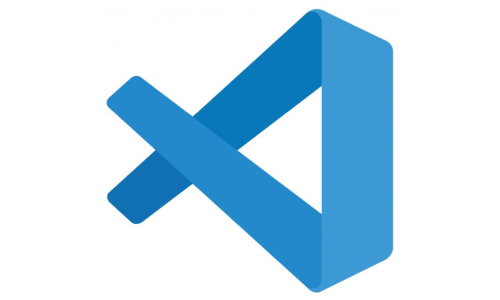

# 1.2. Módulo Processos/Metodologias/Abordagens

## 1.2.1 Introdução

Neste artefato será descrito as abordagens e metodologias escolhidas pela equipe para o desenvolvimento do projeto e fluxos de processos do MyMarket em notação BPMN.

## 1.2.2 Metodologia

A metodologia escolhida foi o Scrum (Adaptado) junto ao XP. Com elas, a equipe pode dividir o tempo em Sprints e fazer o pareamento para desenvolvimento das atividades.

As sprints começam Segunda-Feira às 21h, onde é definido as tarefas que devem ser geradas. Depois disso, é gerada a lista de tarefas que deve ser desenvolvida por cada membro. Nas Quartas-feiras, às 21h, é realizada uma reunião para os membros falarem o que foi desenvolvido no período e o que mais deve ser feito. Por fim, os membros finalizam o desenvolvimento e geram a entrega da sprint.

A metodologia foi esquematizada em um diagrama BPMN por [Rodrigo Wright](https://github.com/RodrigoWright) e [João Costa](https://github.com/jvcostta), conforme a figura abaixo:

## 1.2.3 Ferramentas

|    Nome    |    Ícone    | Uso   |
| ---------- | ----------- | ----- | 
| Discord    | | Reuniões entre membros da equipe | 
| WhatsApp   | | Comunicação rápida de ideias e feedbacks |
| LucidChart | | Desenvolvimento de Rich Pictures e fluxo de processo em BPMN |
| Draw.io | | Desenvolvimento do BPMN |
| Figma | | Elaboração dos protótipos |
| VS Code | | IDE para desenvolvimento do projeto |
| Word | | Elaboração do arquivo de entrega |
| Google Docs | | Elaboração do arquivo de entrevista |
| Teams | | Entrevista com PO |

## 1.2.4 Fluxo dos processos 

Foram feitos três fluxos de processos: a compra de um produto por um cliente (elaborado por [Guilherme Nishimura](https://github.com/Guilherme-nishi) e [Pedro Henrique](https://github.com/pehenobra2)), envio de um produto pela loja (elaborado por [Pedro Lucas](https://github.com/AlefMemTav)) e login do cliente no site (elaborado por [RodrigoWright](https://github.com/RodrigoWright))

### 1.2.4.1 Fluxo de Compra de Produtos

### 1.2.4.2 Fluxo de Envio de Produtoss

### 1.2.4.2 Fluxo de Login do Cliente

## Histórico de Versões

| Versão |     Data    | Descrição   | Autor(es) | Revisor(es) |
| ------ | ----------- | ----------- | --------- | ----------- |
| `1.0`  | 07/04/2024 | início da alteração da estrutura do documento | [ Miguel de Frias ](https://github.com/migueldefrias)| [Guilherme Basilio](https://github.com/GuilhermeBES)|
| `1.1`  | 07/04/2024 | Metodologia escolhida | [ Rodrigo Wright ](https://github.com/RodrigoWright) e [João Costa](https://github.com/jvcostta)| [ Mateus Orlando ](https://github.com/MateusPy) |
| `1.2`  | 07/04/2024 | Adição de BPM  | [ Guilherme Nishimura da Silva ]([https://github.com/RodrigoWright](https://github.com/Guilherme-nishi))| [ Pedro Henrique ]([https://github.com/jvcostta](https://github.com/pehenobra2)) |
| `1.3`  | 08/04/2024 | Revisão do texto  | [ Lucas Spinosa ]([https://github.com/LucasSpinosa])| [Guilherme Oliveira](https://github.com/GG555-13) & [ Rodrigo Wright ](https://github.com/RodrigoWright) |
| `1.4`  | 08/04/2024 | Corrigindo Imagens de Ferramentas  | [ Mateus Orlando ](https://github.com/MateusPy)| [ Rodrigo Wright ](https://github.com/RodrigoWright), [Guilherme Basilio](https://github.com/GuilhermeBES) & [ Miguel de Frias ](https://github.com/migueldefrias) |

