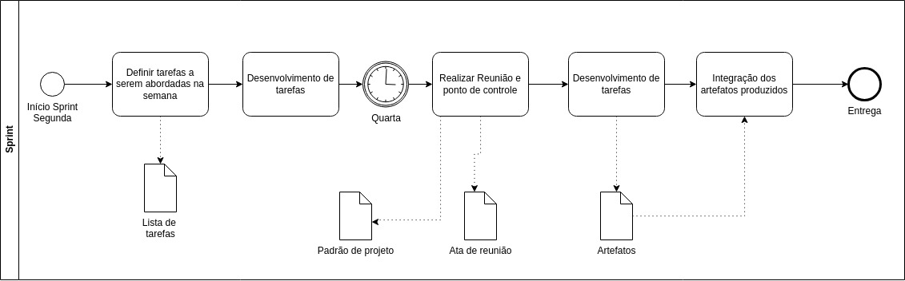
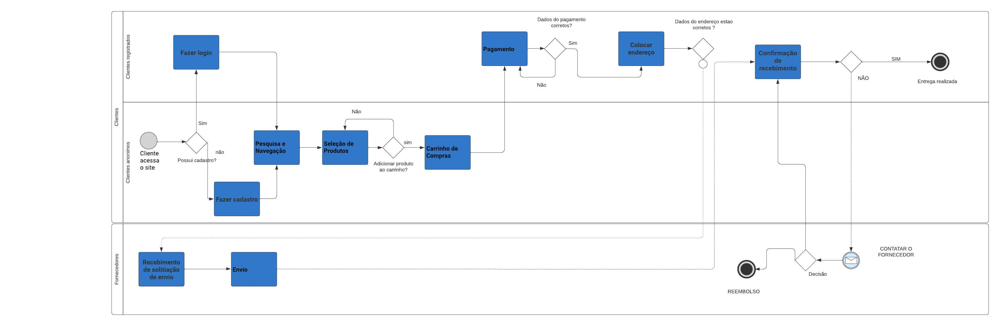
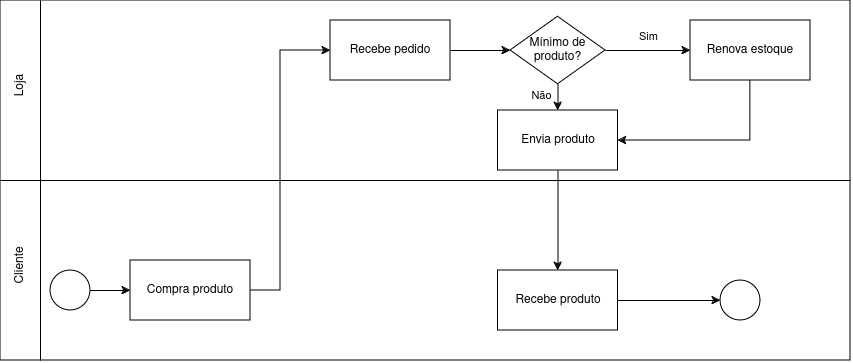
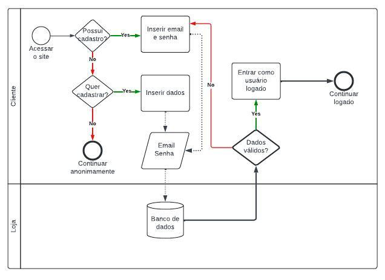

# 1.2. Módulo Processos/Metodologias/Abordagens

## 1.2.1 Introdução

Neste artefato será descrito as abordagens e metodologias escolhidas pela equipe para o desenvolvimento do projeto e fluxos de processos do MyMarket em notação BPMN.

## 1.2.2 Metodologia

A metodologia escolhida foi o Scrum (Adaptado) junto ao XP. Com elas, a equipe pode dividir o tempo em Sprints e fazer o pareamento para desenvolvimento das atividades.

As sprints começam Segunda-Feira às 21h, onde é definido as tarefas que devem ser geradas. Depois disso, é gerada a lista de tarefas que deve ser desenvolvida por cada membro. Nas Quartas-feiras, às 21h, é realizada uma reunião para os membros falarem o que foi desenvolvido no período e o que mais deve ser feito. Por fim, os membros finalizam o desenvolvimento e geram a entrega da sprint.

A metodologia foi esquematizada em um diagrama BPMN por [Rodrigo Wright](https://github.com/RodrigoWright) e [João Costa](https://github.com/jvcostta), conforme a figura abaixo:

## 1.2.3 Ferramentas

|    Nome    |    Ícone    | Uso   |
| :-----: | :----: | ----------- |
| <a href="https://discord.com/">Discord</a> |  |  Ferramenta utilizada para a reuniões |
| <a href="https://www.whatsapp.com/">WhatsApp</a> |  |  Ferramenta utilizada para a comunicação |
| <a href="https://www.lucidchart.com/pages/">LucidChart</a> |  | Desenvolvimento de Rich Pictures e fluxo de processo em BPMN |
| <a href="https://www.drawio.com/">Draw.io</a> | | Desenvolvimento do BPMN |
| <a href="https://www.figma.com/">Figma</a> |  |  Elaboração dos protótipos |
| <a href="https://code.visualstudio.com/">VSCode</a> |   | IDE para desenvolvimento do projeto |
| <a href="https://www.microsoft.com/pt-br/microsoft-365/word">Word</a> |  | Elaboração do arquivo de entrega |
| <a href="https://www.google.com/docs/about/">Docs</a> |  | Elaboração do arquivo de entrevista |
| <a href="https://www.microsoft.com/pt-br/microsoft-teams/group-chat-software">Teams</a> |  | Entrevista com PO |

## 1.2.4 Fluxo dos processos 

Foram feitos três fluxos de processos: a compra de um produto por um cliente (elaborado por [Guilherme Nishimura](https://github.com/Guilherme-nishi) e [Pedro Henrique](https://github.com/pehenobra2)), envio de um produto pela loja (elaborado por [Pedro Lucas](https://github.com/AlefMemTav)) e login do cliente no site (elaborado por [RodrigoWright](https://github.com/RodrigoWright))

### 1.2.4.1 Fluxo de Compra de Produtos

### 1.2.4.2 Fluxo de Envio de Produtoss

### 1.2.4.2 Fluxo de Login do Cliente

## Histórico de Versões

| Versão |     Data    | Descrição   | Autor(es) | Revisor(es) |
| ------ | ----------- | ----------- | --------- | ----------- |
| `1.0`  | 07/04/2024 | início da alteração da estrutura do documento | [ Miguel de Frias ](https://github.com/migueldefrias)| [Guilherme Basilio](https://github.com/GuilhermeBES)|
| `1.1`  | 07/04/2024 | Metodologia escolhida | [ Rodrigo Wright ](https://github.com/RodrigoWright) e [João Costa](https://github.com/jvcostta)| [ Mateus Orlando ](https://github.com/MateusPy) |
| `1.2`  | 07/04/2024 | Adição de BPM  | [ Guilherme Nishimura da Silva ]([https://github.com/RodrigoWright](https://github.com/Guilherme-nishi))| [ Pedro Henrique ]([https://github.com/jvcostta](https://github.com/pehenobra2)) |
| `1.3`  | 08/04/2024 | Revisão do texto  | [ Lucas Spinosa ]([https://github.com/LucasSpinosa])| [Guilherme Oliveira](https://github.com/GG555-13) & [ Rodrigo Wright ](https://github.com/RodrigoWright) |
| `1.4`  | 08/04/2024 | Corrigindo Imagens de Ferramentas  | [ Mateus Orlando ](https://github.com/MateusPy)| [ Rodrigo Wright ](https://github.com/RodrigoWright), [Guilherme Basilio](https://github.com/GuilhermeBES) & [ Miguel de Frias ](https://github.com/migueldefrias) |
| `1.4.1`  | 12/04/2024 | Corrigindo Novamente Imagens de Ferramentas  | [ Artur Rodrigues ](https://github.com/ArturRSA19)| [João Costa](https://github.com/jvcostta) & [ Mateus Orlando ](https://github.com/MateusPy) |
| `1.4.2`  | 12/04/2024 | Corrigindo e Adicionando Imagens de Ferramentas  | [ Artur Rodrigues ](https://github.com/ArturRSA19)| [guilherme Soares](https://github.com/guilhermesoaress) |

