# Rich Picture

## 1. Introdução

Um "rich picture" é uma ferramenta visual utilizada para capturar e entender a complexidade de sistemas ou situações problemáticas, usando desenhos e textos curtos e objetivos para representar momentos, atividades, entre outras necessidades.

Essa abordagem colaborativa e iterativa facilita a identificação de problemas e oportunidades, promovendo uma compreensão compartilhada e um diálogo produtivo entre stakeholders, ajudando assim a visualizar soluções integradas para desafios complexos.

Esse documento busca apresentar os Rich Pictures elaborados pelos membros da equipe durante a fase Sketch da Design Sprint, elaborados para ilustrar a relação entre os atores e sistema envolvidos nos fluxos compreendidos no ponto de vista individual e coletivo da equipe.

## 2. Metodologia

Tendo como base os conhecimentos explanados em sala e no material disponibilizado pela professora, cada integrante do grupo ficou responsável por criar um Rich Picture que representasse um pouco da visão que ele tem acerca do projeto, sendo alguns de processos específicos e outros do sistema como um todo. 

Após a confecção individual, o grupo se reuniu através do Discord para discutir as ideias de cada membro, e por fim montar um modelo final que sintetizasse os pensamentos do grupo, criando o Rich Picture da fase Decision da Design Sprint.

### 2.1 Rich Pictures Individuais

### 2.1.1 - Mateus Orlando

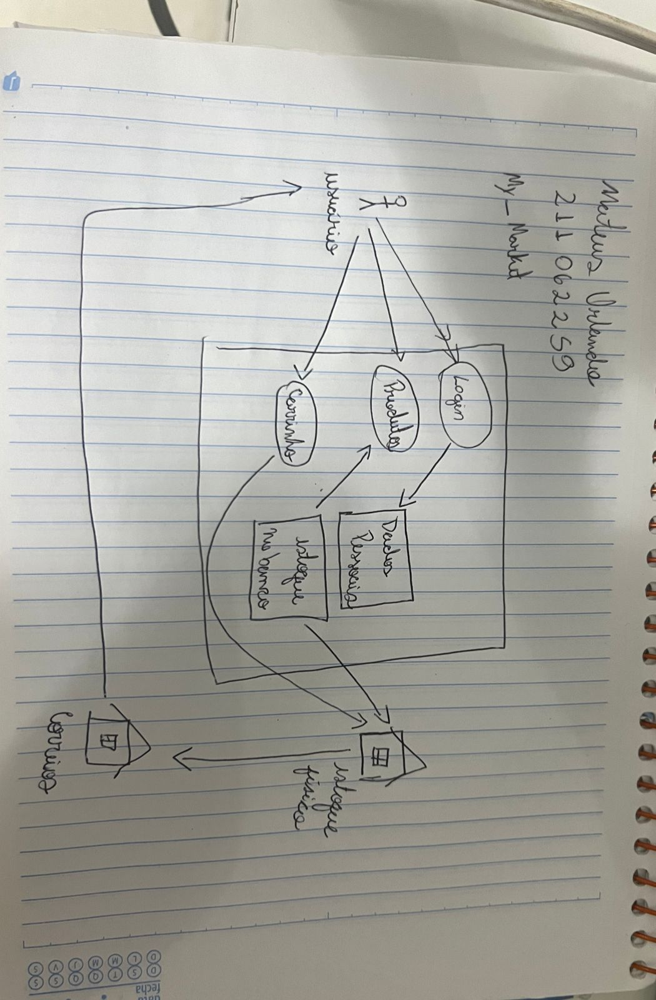

### 2.1.2 - João Victor Costa

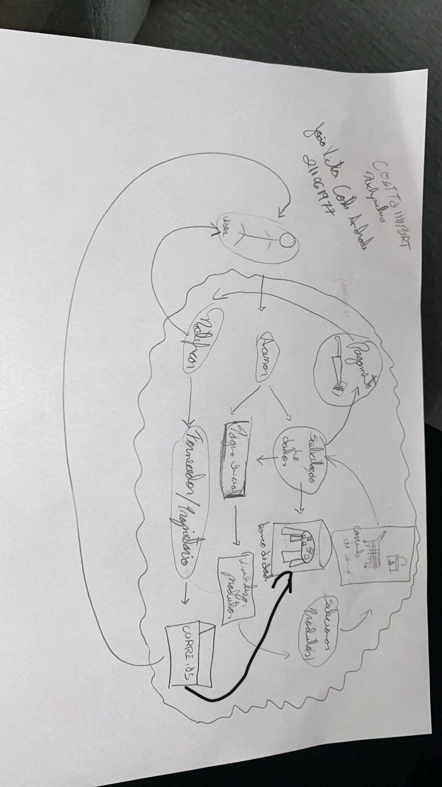

### 2.1.3 - Guilherme de Oliveira Mendes

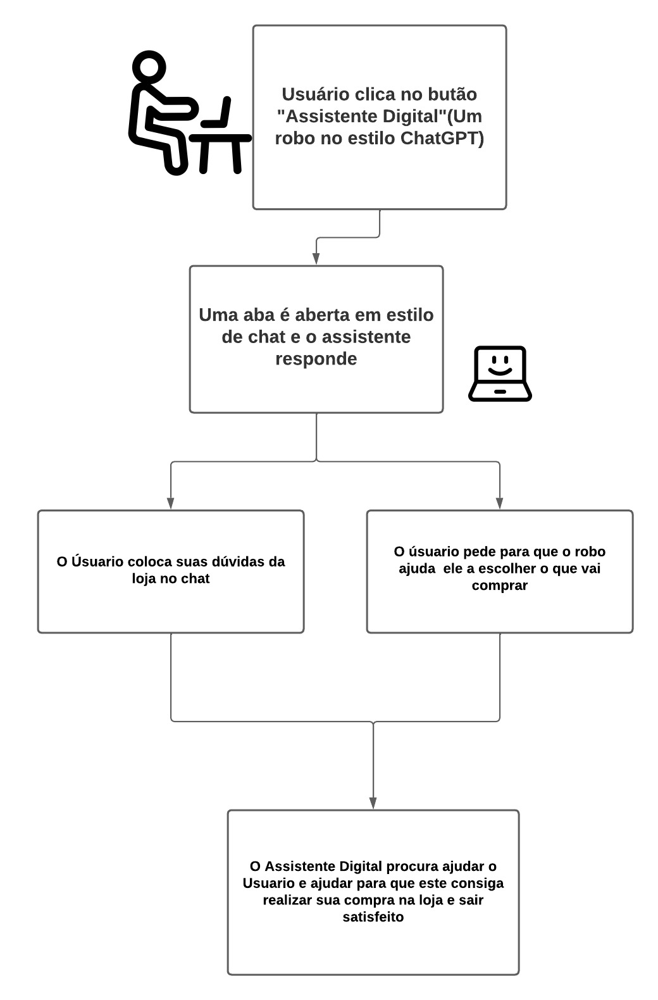

### 2.1.3 - Pedro Henrique Nogueira

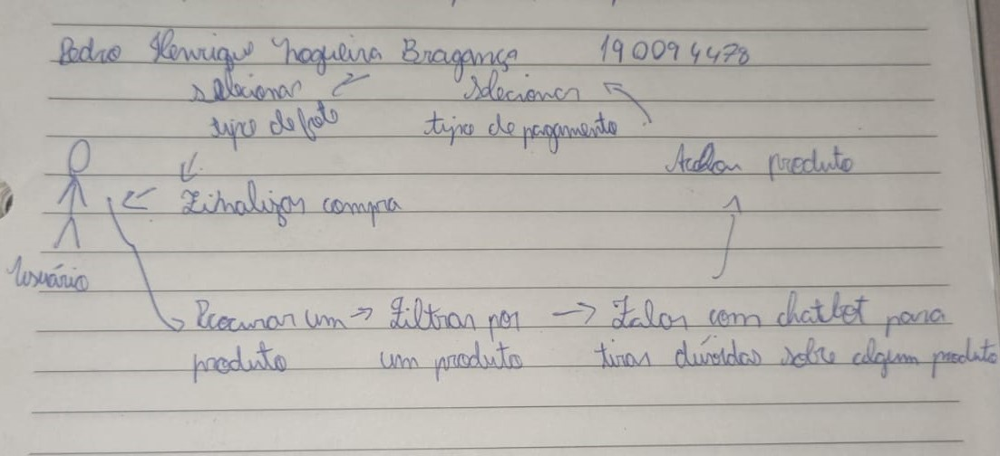

### 2.1.4 - Guilherme Nishimura

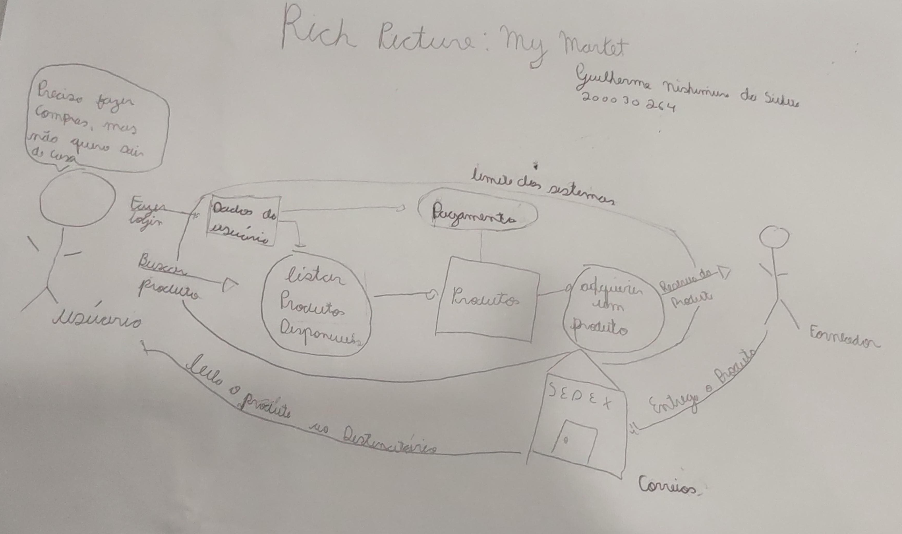

### 2.1.5 - Pedro Lucas

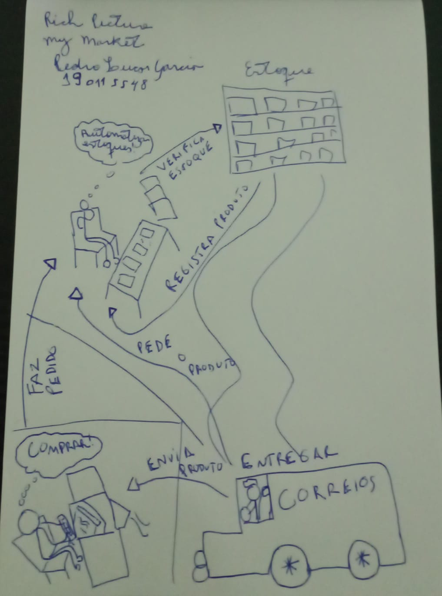

### 2.1.6 - Rodrigo Wright

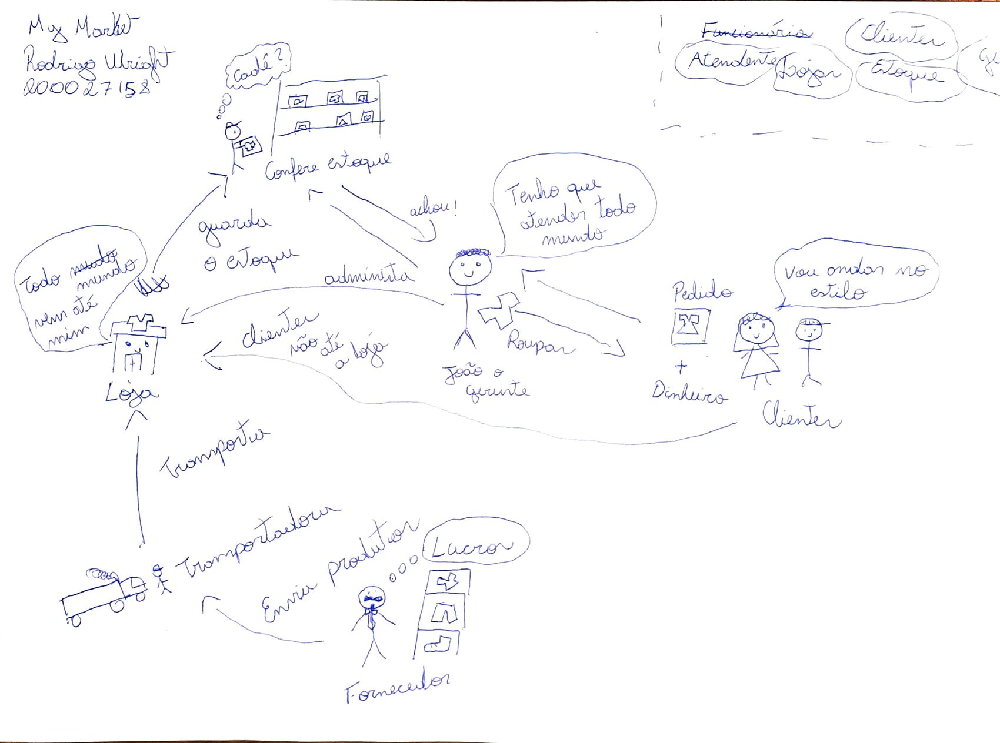

### 2.1.7 - Artur Rodrigues

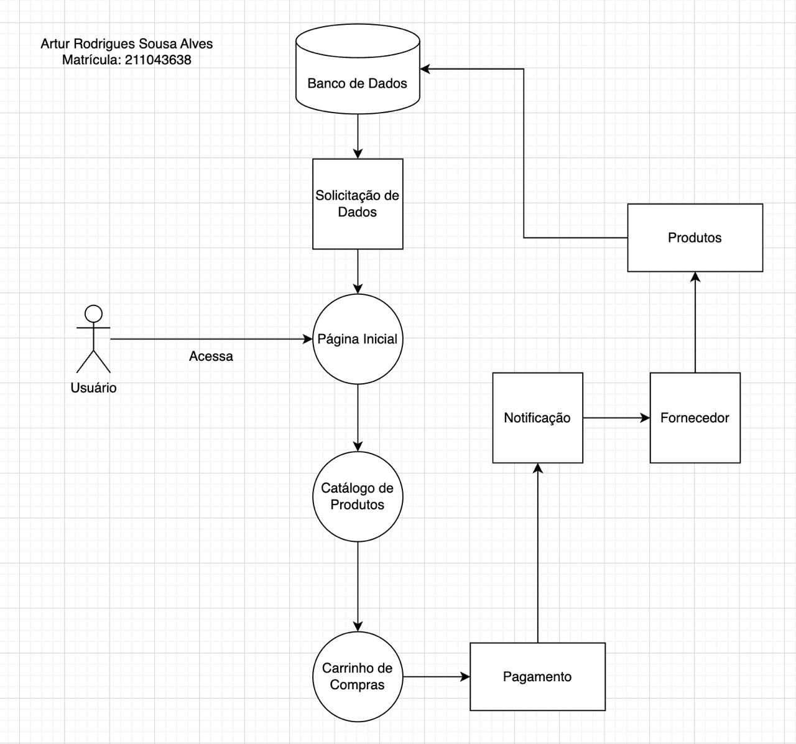

### 2.1.8 - Guilherme Soares

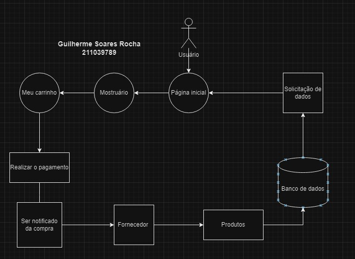

### 2.1.9 - Guilherme Basilio

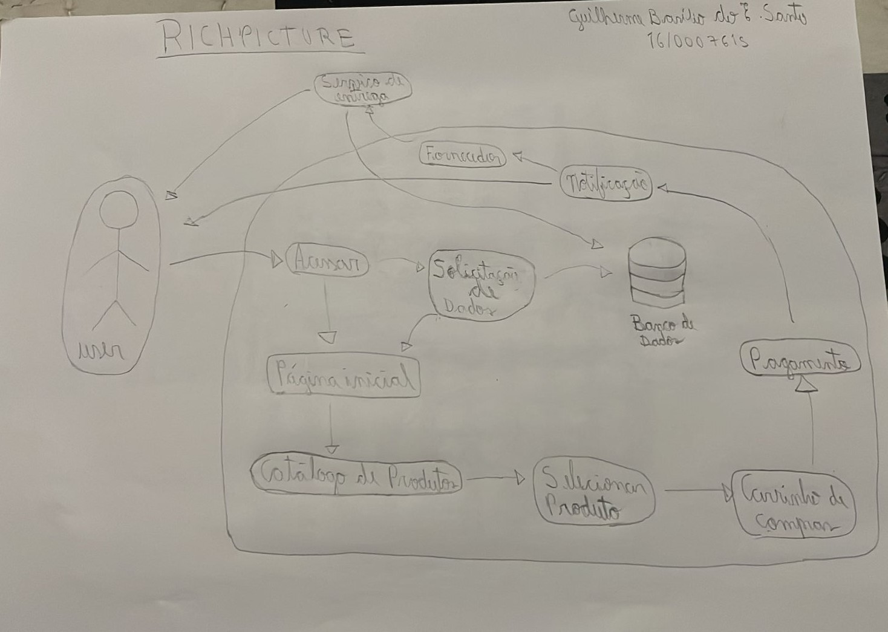

### 2.1.10 - Miguel de Frias

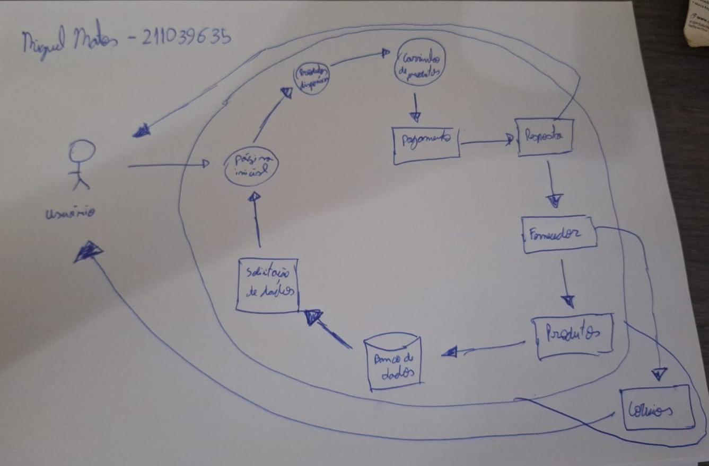

### 2.1.11 - Lucas Spinosa

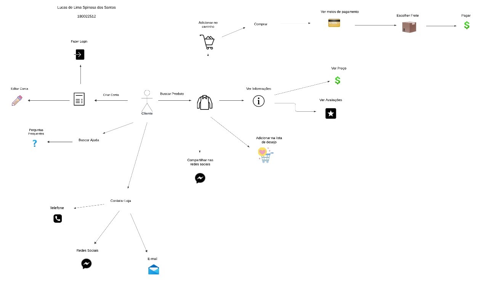

### 2.2 Rich Picture Final

Diante de todos os Rich Pictures, escolheu-se modificar o de Lucas Spinosa para ser o Rich Picture da fase Decision.

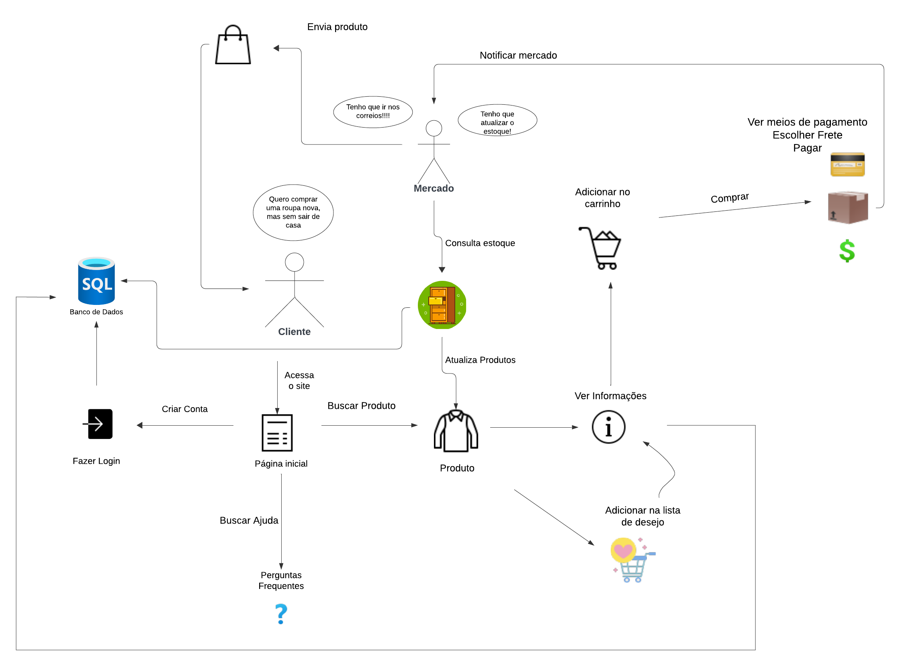
 

## 3. Referências Bibliográficas

> SERRANO, Milene. Arquitetura e Desenho de Software: AULA - Projeto e desenho de software. Disponível em: <https://aprender3.unb.br/course/view.php?id=19535>. Acesso em: 05 abr. de 2024.

> Rich Picture. Wiki Arquitetura e Desenho de Software - Magazine Luiza. Disponível em: <https://unbarqdsw2023-2.github.io/2023.2_G8_ProjetoMagazineLuiza/#/./Base/RichPicture>. Acesso em: 06 abr. de 2024.

## 4. Histórico de versionamento

|    Data    | Versão |      Descrição       |                   Autor(a)                    |                   Revisor(a)                    |
| ---------- | ------ | -------------------- | --------------------------------------------- | ----------------------------------------------- |
| 05/04/2024 |  1.0   | Criação do documento   | [Mateus Orlando](https://github.com/MateusPy)  | -     |
| 05/04/2024 |  1.1   | Conclusão do documento | [Mateus Orlando](https://github.com/MateusPy)  | Todos |
| 08/04/2024 |  1.1   | Revisão do Texto       | [LucasSpinosa](https://github.com/LucasSpinosa)| Todos |