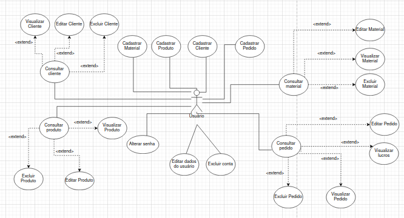

# Diagrama de Casos de Uso

**Após parecer da professora na segunda entrega, o grupo julgou importante a modelagem de um diagrama de casos de uso para o projeto. Para tal, o aluno Pedro Lucas Garcia ficou responsável por modelar e documentar esse diagrama.**

## 1. Introdução

O diagrama de casos de uso é uma ferramenta utilizada na modelagem de sistemas para descrever as interações entre os atores (usuários ou outros sistemas) e as funcionalidades que o sistema deve fornecer. Esses diagramas ajudam a capturar os requisitos funcionais de um sistema, mostrando de forma clara o que o sistema deve fazer sem entrar em detalhes sobre como essas funcionalidades serão implementadas.

### Elementos principais de um diagrama de casos de uso:

- Atores: Representam os usuários ou sistemas externos que interagem com o sistema. Eles são representados por figuras de stickman.

- Casos de Uso: Representam as funcionalidades ou serviços que o sistema oferece aos atores. Eles são representados por elipses com o nome da funcionalidade dentro.

- Relações: Representam as interações entre os atores e os casos de uso, bem como as interações entre os próprios casos de uso. As relações são representadas por linhas que conectam atores aos casos de uso ou por setas que conectam casos de uso entre si.

### Tipos de relações no diagrama de casos de uso:

- Relação de Inclusão (Include): 

É utilizada quando um caso de uso (chamado de caso de uso base) inclui o comportamento de outro caso de uso (chamado de caso de uso incluído).

Isso significa que sempre que o caso de uso base for executado, o caso de uso incluído também será.

Exemplo: Em um sistema bancário, o caso de uso "Sacar Dinheiro" pode incluir o caso de uso "Autenticar Usuário", pois para sacar dinheiro, o usuário precisa ser autenticado.

- Relação de Extensão (Extend): 

É utilizada quando um caso de uso (chamado de caso de uso base) pode ser estendido por outro caso de uso (chamado de caso de uso estendido) em situações específicas.

O caso de uso base pode funcionar sozinho, mas em certos contextos, o caso de uso estendido pode ser executado para adicionar comportamentos adicionais.

Exemplo: No mesmo sistema bancário, o caso de uso "Sacar Dinheiro" pode ser estendido pelo caso de uso "Imprimir Recibo", que é executado apenas se o usuário solicitar um recibo.

- Generalização: 

Similar ao conceito de herança em programação orientada a objetos, onde um ator ou caso de uso filho herda o comportamento de um ator ou caso de uso pai.

Exemplo: Um ator "Cliente" pode ter uma generalização para "Cliente VIP", onde o "Cliente VIP" herda as funcionalidades do "Cliente", mas também pode ter funcionalidades adicionais.

Esses elementos combinados em um diagrama de casos de uso ajudam a esclarecer como as diferentes partes de um sistema interagem e quais funcionalidades são obrigatórias, opcionais ou condicionais. Eles são uma parte essencial na fase de análise de requisitos e ajudam a garantir que todas as necessidades dos usuários sejam consideradas no projeto do sistema.

## 3. Diagrama de Casos de Uso

Na figura 1, está representado o diagrama de casos de uso realizado pelo aluno **Pedro Lucas Garcia**.

Figura 1 - Diagrama de Casos de Uso.  Autor: Pedro Lucas.

## 4. Conclusão

Em resumo, o diagrama de casos de uso é uma ferramenta poderosa para a modelagem de sistemas, permitindo a visualização clara das interações entre os atores e as funcionalidades do sistema. Através das relações de include, extend e generalização, é possível detalhar como os diferentes casos de uso se inter-relacionam, oferecendo uma visão completa das funcionalidades obrigatórias, opcionais e condicionais. Esse tipo de diagrama facilita o entendimento do que o sistema deve fazer, garantindo que todos os requisitos funcionais sejam devidamente considerados, o que é crucial para o sucesso no desenvolvimento de software.

## 5. Referências

> Diagrama de Casos de Uso - Documentação da IBM . Disponível em: https://www.ibm.com/docs/pt-br/rsm/7.5.0?topic=diagrams-use-case. Acesso em: 09 ago. 2024.

## Histórico de Versões

| Versão |     Data    | Descrição   | Autor(es) | Revisor(es) |
| ------ | ----------- | ----------- | --------- | ----------- |
| `1.0`  | 09/08/2024 | Criação | [Pedro Lucas](https://github.com/AlefMemTav) | - |

