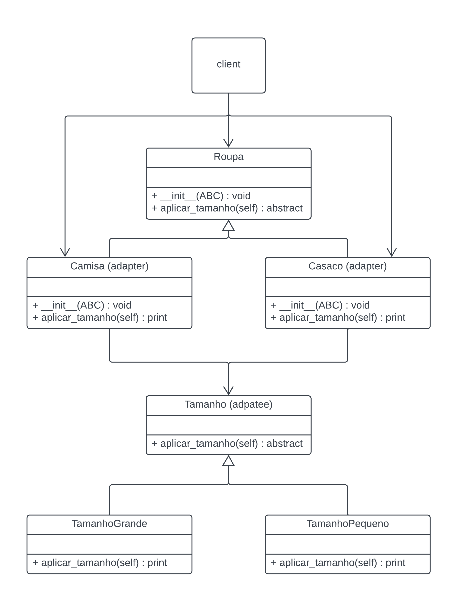

# Bridge - GoF estrutural

## 1. Introdução

O padrão de projeto estrutural Adapter permite a criação de classes intermediárias, que oferecem interfaces para duas classes usando composição ou herança. Isso permite o aproveitamento de códigos já existentes, sem alterar o seu funcionamento, enquanto adiciona novos códigos ou métodos.

> Converter a interface de uma classe em outra interface, esperada pelos clientes. O Adapter permite que classes com interfaces incompatíveis trabalhem em conjunto – o que, de outra forma, seria impossível (Livro: Padrões de Projeto, pg. 135)

## 2. Objetivo

Demonstrar o uso do Adapter em um projeto gerando uma classe Adapter que herda métodos de uma classe mãe e depois os sobrescreve (override) para fazer algo específico.

## 3. Implementação
### 3.1 Diagrama UML

Classe Camisa e Casaco (Adapters) herdam da classe mãe Roupa o método aplicar_tamanho() e o sobrescrevem (override) fazendo um print e chamando a classe Tamanho (Adaptee). Essa classe possui um método aplicar_tamanho() mais específico, que aplica o tamanho grande ou pequeno.


<h6 align = "center">Figura 1: Diagrama de classes Adapter</h6>

### 3.2 Código
Aqui está um exemplo simples de implementação do padrão Adapter em Python no contexto do diagrama UML:

Primeiro é definido uma interface para a implementação (Tamanho) e duas classes concretas que a implementam (TamanhoPequeno e TamanhoGrande):

```Python
from abc import ABC, abstractmethod

class Tamanho(ABC):
    @abstractmethod
    def aplicar_tamanho(self):
        pass

class TamanhoPequeno(Tamanho):
    def aplicar_tamanho(self):
        print("Aplicando tamanho pequeno")

class TamanhoGrande(Tamanho):
    def aplicar_tamanho(self):
        print("Aplicando tamanho grande")
```

Depois é implementado uma interface para a abstração (Roupa) e classes concretas que a implementam (Camisa e Casaco):

```Python
class Roupa(ABC):
    def __init__(self, tamanho):
        self._tamanho = tamanho

    @abstractmethod
    def aplicar_tamanho(self):
        pass

class Camisa(Roupa):
    def __init__(self, tamanho):
        super().__init__(tamanho)

    def aplicar_tamanho(self):
        print("Camisa:")
        self._tamanho.aplicar_tamanho()

class Casaco(Roupa):
    def __init__(self, tamanho):
        super().__init__(tamanho)

    def aplicar_tamanho(self):
        print("Casaco:")
        self._tamanho.aplicar_tamanho()
```
Após isso é feita uma função que permita que o cliente acione as instâncias de Camisa e Casaco, cada uma usando diferentes implementações de Tamanho:

```Python
def main():

    camisa_pequena = Camisa(TamanhoPequeno())
    camisa_grande = Camisa(TamanhoGrande())
    camisa_pequena.aplicar_tamanho()  
    camisa_grande.aplicar_tamanho()   


    casaco_pequeno = Casaco(TamanhoPequeno())
    casaco_grande = Casaco(TamanhoGrande())
    casaco_pequeno.aplicar_tamanho()  
    casaco_grande.aplicar_tamanho()   

if __name__ == "__main__":
    main()

```

## Resultado
Após rodar o código acima vai imprimir o seguinte reultado:
```Python
Camisa:
Aplicando tamanho pequeno
Camisa:
Aplicando tamanho grande
Casaco:
Aplicando tamanho pequeno
Casaco:
Aplicando tamanho grande
```
Isso demostra que o código está funcionando no padrão do Bridge, permitindo que a abstração (**Camisa**, **Casaco**) e a implementação (**TamanhoPequeno**, **TamanhoGrande**) possam variar independentemente.
## Referências

> **Arquitetura e Desenho de Software - Aula GoFs Criacionais**. Material de apoio em slides. Milene Serrano.

> Gamma, Erich, et al. **Padrões de projetos: soluções reutilizáveis de software orientados a objetos.** Disponível em: Minha Biblioteca, Grupo A, 2000.

## Versionamento

| Versão | Alteração |  Responsável  | Revisor | Data de realização | Data de revisão |
| :------: | :---: | :-----: | :----: | :----: | :-----: |
| 1.0    | Inicio da estrutura do documento | [RodrigoWright](https://github.com/RodrigoWright) | [Guilherme Oliveira](https://github.com/GG555-13) | 24/07/2023 | 24/07/2023 |
| 1.1 | Código e Resultado | [Guilherme Oliveira](https://github.com/GG555-13)| [RodrigoWright](https://github.com/RodrigoWright) | 25/07/2023 | 25/07/2023 |


