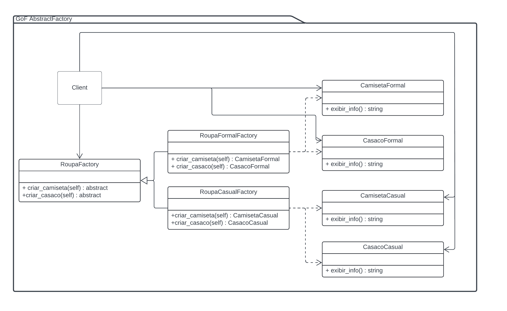

# Abstract Factory - GoF Criacional

## 1. Introdução

O Abstract Factory é um padrão de projeto criacional que oferece uma interface para criação de famílias de objetos, sem especificar suas classes concretas. Isso perminte que os clientes fiquem independentes do padrão de interação dessas classes concretas. Sendo assim, mudanças de estilos e padrões das classes concretas no futuro se torna mais fácil, pois os clientes não conversam diretamente com ela.

> Fornecer uma interface para criação de famílias de objetos relacionados ou dependen- tes sem especificar suas classes concretas. (Livro: Padrões de Projetos)


## 2. Objetivo

Demonstrar o uso do padrão de projeto Abstract Factory, criando objetos de classes concretas por meio das famílias de Factories.

## 3. Implementação


### 3.1 Diagrama UML
Cliente se comunica com a classe geradora RoupaFactory que gera outras classes filhas RoupaFactoryFormal e RoupaFactoryCasual. Essas classes filhas são responsáveis por criar as classes concretas camiseta e casaco do tipo casual e formal.


<h6 align = "center">Figura 1: Diagrama de classes Abstract Factory</h6>

### 3.2 Código

Aqui está um exemplo simples de implementação do padrão Abstract Factory em Python no contexto do diagrama UML:

Primeiro é definido as interfaces para os produtos, no nosso exemplo esse são tipos de camisa e casacos podendo essas ser casual ou formal

```Python
from abc import ABC, abstractmethod

class Camiseta(ABC):
    @abstractmethod
    def exibir_info(self):
        pass

class Casaco(ABC):
    @abstractmethod
    def exibir_info(self):
        pass


```

Depois os produtos estarem definidos, as classes concretas para as roupas Casual e Formal são implementados:

```Python
class CamisetaCasual(Camiseta):
    def exibir_info(self):
        print("Camiseta Casual")

class CamisetaFormal(Camiseta):
    def exibir_info(self):
        print("Camiseta Formal")


class CasacoCasual(Casaco):
    def exibir_info(self):
        print("Casaco Casual")

class CasacoFormal(Casaco):
    def exibir_info(self):
        print("Casaco Formal")

```
Após isso a interface da fábrica abstrata que cria os produtos é definida:

```Python
class RoupaFactory(ABC):
    @abstractmethod
    def criar_camiseta(self):
        pass

    @abstractmethod
    def criar_casaco(self):
        pass
```
Agora, é criada a interface da fábrica abstrata que cria os produtos:

```Python
    def criar_camiseta(self):
        return CamisetaCasual()

    def criar_casaco(self):
        return CasacoCasual()

class RoupaFormalFactory(RoupaFactory):
    def criar_camiseta(self):
        return CamisetaFormal()

    def criar_casaco(self):
        return CasacoFormal()

```
Agora, as fábricas são usadas para criar e exibir informações sobre as roupas:

```Python
from fabrica import RoupaCasualFactory, RoupaFormalFactory

def main():
    # Fábrica de Roupas Casuais
    roupa_casual_factory = RoupaCasualFactory()
    camiseta_casual = roupa_casual_factory.criar_camiseta()
    casaco_casual = roupa_casual_factory.criar_casaco()
    camiseta_casual.exibir_info()  
    casaco_casual.exibir_info()     

    # Fábrica de Roupas Formais
    roupa_formal_factory = RoupaFormalFactory()
    camiseta_formal = roupa_formal_factory.criar_camiseta()
    casaco_formal = roupa_formal_factory.criar_casaco()
    camiseta_formal.exibir_info()  
    casaco_formal.exibir_info()     

if __name__ == "__main__":
    main()
```
## Resultado
Após rodar o código acima vai imprimir o seguinte reultado:
```Python
Camiseta Casual
Casaco Casual
Camiseta Formal
Casaco Formal
```
Isso demostra que o código está funcionando no padrão do Abstract Factory,permitindo que ele crie famílias de produtos relacionados sem se preocupar com suas implementações concretas, promovendo a flexibilidade e a escalabilidade do código.

## Referências

> **Arquitetura e Desenho de Software - Aula GoFs Criacionais**. Material de apoio em slides. Milene Serrano.

> Gamma, Erich, et al. **Padrões de projetos: soluções reutilizáveis de software orientados a objetos.** Disponível em: Minha Biblioteca, Grupo A, 2000.

> REFATORING GURU. **Abstract Factory Design Pattern**. Disponível em: https://refactoring.guru/pt-br/design-patterns/abstract-factory. Acesso em: 24 jul. 2024.

## Versionamento

| Versão | Alteração |  Responsável  | Revisor | Data de realização | Data de revisão |
| :------: | :---: | :-----: | :----: | :----: | :-----: |
| 1.0    | Inicio da estrutura do documento | [RodrigoWright](https://github.com/RodrigoWright) | [Guilherme Oliveira](https://github.com/GG555-13) | 24/07/2023 | 24/07/2023 |
| 1.1 | Texto introdutório | [RodrigoWright](https://github.com/RodrigoWright) | [Guilherme Oliveira](https://github.com/GG555-13) | 24/07/2023 | 24/07/2023 | 
| 1.2 | Texto e diagrama de classes | [RodrigoWright](https://github.com/RodrigoWright) | [Guilherme Oliveira](https://github.com/GG555-13) | 24/07/2023 | 24/07/2023 | 
| 1.3 | Código e Resultado | [Guilherme Oliveira](https://github.com/GG555-13)| [RodrigoWright](https://github.com/RodrigoWright) | 25/07/2023 | 25/07/2023 | 
