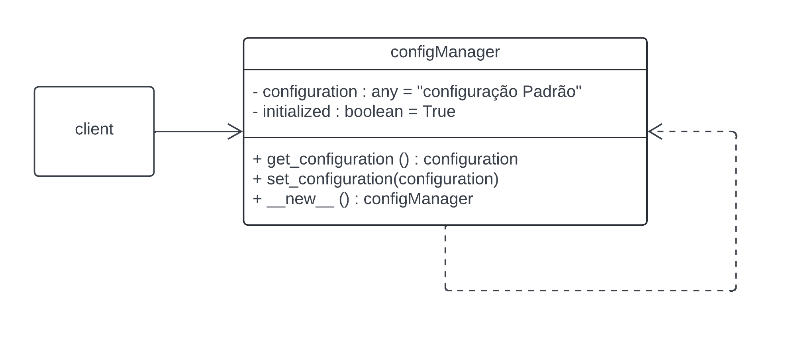

# Singleton - GoF Criacional

## 1. Introdução

O padrão Singleton é um padrão de projeto criacional simples, cujo principal objetivo é garantir que uma classe tenha apenas uma instância e forneça um ponto global de acesso a essa instância (Livro: Padrões de Projeto, pg. 125). Essa abordagem é especialmente útil em cenários onde é crucial ter um único ponto de controle, como no gerenciamento de configurações de aplicativos, conexões a bancos de dados ou caches.

## 2. Objetivo

Demonstrar o uso do Singleton em um projeto, criando uma classe gerenciadora com pontos de acesso globais para o client.

## 3. Implementação
### 3.1 Diagrama UML

Um configManager que comanda todas as operações e gera outros configManagers.


<h6 align = "center">Figura 1: Diagrama de classes Singleton</h6>

### 3.2 Código

Aqui está um exemplo simples de implementação do padrão Singleton em Python no contexto do diagrama UML:

Primeiro é criado o método (**new**) para garantir que apenas uma instância de ConfigManager seja criada. de a instância _instance ainda não foi criada, ela é criada, caso contrário, a instância existente é retornada:

```Python
class ConfigManager:
    _instance = None

    def __new__(cls, *args, **kwargs):
        if not cls._instance:
            cls._instance = super(ConfigManager, cls).__new__(cls, *args, **kwargs)
        return cls._instance

```

Depois é feito o método (**init**) que serve para inicializar a configuração apenas se a instância ainda não foi inicializada, isso evita a re-inicialização da instância existente:

```Python
class ConfigManager:
    _instance = None

    def __init__(self):
        if not hasattr(self, 'initialized'):
            self.configuration = "Configuração padrão"
            self.initialized = True
```

Após isso são feitos os métodos (**get_configuration**) e (**set_configuration**) que são usados para acessar e modificar a configuração da aplicação:

```Python
class ConfigManager:
    _instance = None

    def get_configuration(self):
        return self.configuration

    def set_configuration(self, configuration):
        self.configuration = configuration
```
Depois é feito um script para testar o comportamento do Singleton, criando uma instância, modificando ela, chamando ela denovo e fazendo uma comparação da primeira e a nova chamada para ver se as instâncias são iguais:

```Python
def main():
    # Pega a instancia do ConfigManager
    config_manager1 = ConfigManager()
    print(config_manager1.get_configuration())  

    # Muda a configuração
    config_manager1.set_configuration("Nova configuração")

    # Pega a instancia e verifica a configuração
    config_manager2 = ConfigManager()
    print(config_manager2.get_configuration())  

    # Verificação
    print(config_manager1 == config_manager2)  

if __name__ == "__main__":
    main()
```


## Resultado
Após rodar o código acima vai imprimir o seguinte reultado:
```Python
Configuração padrão
Nova configuração
True
```
Isso demostra que o código está funcionando no padrão do Singleton,garantindo que apenas uma instância de **ConfigManager** seja criada e compartilhada em toda a aplicação.

## Referências

> **Arquitetura e Desenho de Software - Aula GoFs Criacionais**. Material de apoio em slides. Milene Serrano.

> Gamma, Erich, et al. **Padrões de projetos: soluções reutilizáveis de software orientados a objetos.** Disponível em: Minha Biblioteca, Grupo A, 2000.

>REFATORING GURU. Singleton Design Pattern. Disponível em: https://refactoring.guru/pt-br/design-patterns/singleton. Acesso em: 25 jul. 2024.
 

## Versionamento

| Versão | Alteração |  Responsável  | Revisor | Data de realização | Data de revisão |
| :------: | :---: | :-----: | :----: | :----: | :-----: |
| 1.0    | Inicio da estrutura do documento | [RodrigoWright](https://github.com/RodrigoWright) | [Guilherme Oliveira](https://github.com/GG555-13) | 24/07/2023 | 24/07/2023 |
| 1.1 | Texto introdutório | [RodrigoWright](https://github.com/RodrigoWright) | [Guilherme Oliveira](https://github.com/GG555-13) | 24/07/2023 | 24/07/2023 | 
| 1.2 | Texto e diagrama de classes | [RodrigoWright](https://github.com/RodrigoWright) | [Guilherme Oliveira](https://github.com/GG555-13) | 24/07/2023 | 24/07/2023 |  
| 1.3 | Código e Resultado | [Guilherme Oliveira](https://github.com/GG555-13)| [RodrigoWright](https://github.com/RodrigoWright) | 25/07/2023 | 25/07/2023 | 


