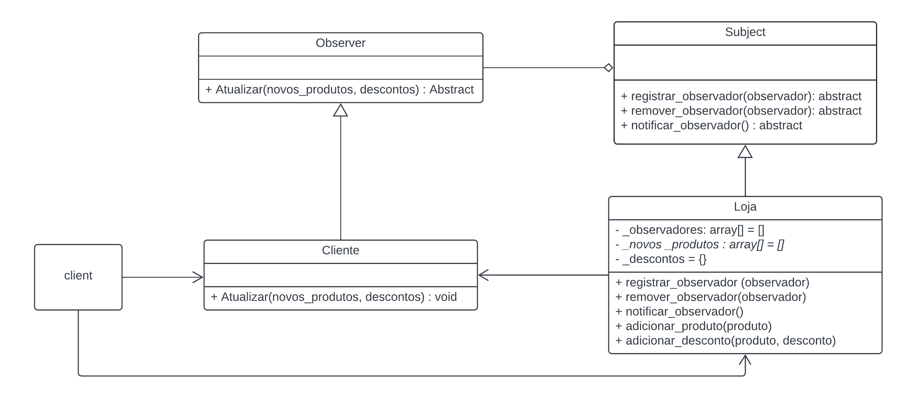

# Observer - GoF Comportamental

## 1. Introdução

O padrão de projeto comportamental Observer se baseia em uma cadeia de dependência de objetos, onde se um dos objetos muda de estado, todos os outros são notificados. Remetendo a ideia de que os outros objetos estão observando o estado desse outro objeto, para agir de acordo.

> Definir uma dependência um-para-muitos entre objetos, de maneira que quando um objeto muda de estado todos os seus dependentes são notificados e atualizados automaticamente (Livro: Padrão de projetos, pg. 269)

## 2. Objetivo

Demonstrar o uso do Observer, criando um tipo de classe Observer que tem um método que atualiza com base na mudança de estado de outra classe.

## 3. Implementação
### 3.1 Diagrama UML

Classe Loja, possui uma lista de objetos da classe Clientes que são observadores, quando há um desconto ou um novo produto a ser aplicado, os objetos da classe Cliente ativam o método Atualizar().

<h6 align = "center">Figura 1: Diagrama de classes Observer</h6>

### 3.2 Código

## Resultado

## Referências

> **Arquitetura e Desenho de Software - Aula GoFs Criacionais**. Material de apoio em slides. Milene Serrano.

> Gamma, Erich, et al. **Padrões de projetos: soluções reutilizáveis de software orientados a objetos.** Disponível em: Minha Biblioteca, Grupo A, 2000.

## Versionamento

| Versão | Alteração |  Responsável  | Revisor | Data de realização | Data de revisão |
| :------: | :---: | :-----: | :----: | :----: | :-----: |
| 1.0    | Inicio da estrutura do documento | [RodrigoWright](https://github.com/RodrigoWright) | [Guilherme Oliveira](https://github.com/GG555-13) | 24/07/2023 | 24/07/2023 |
| 1.1 | Texto introdutório | [RodrigoWright](https://github.com/RodrigoWright) | [Guilherme Oliveira](https://github.com/GG555-13) | 24/07/2023 | 24/07/2023 |
| 1.2 | Texto e diagrama de classes | [RodrigoWright](https://github.com/RodrigoWright) | [Guilherme Oliveira](https://github.com/GG555-13) | 24/07/2023 | 24/07/2023 |   

